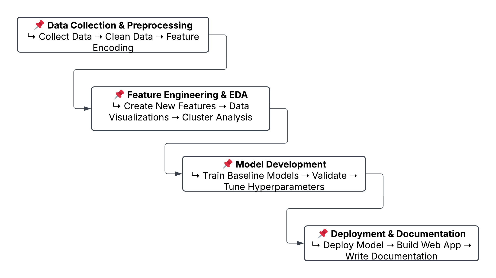

> [!NOTE]
> This project has its own folder because it marked a significant learning milestone for me >> my first capstone project spanning over 10 days

Inspired by [Youla Sozen’s work](https://github.com/youlasozen/predicting-the-Market-Value-of-Footballers).

Every project begins with a question or problem. This one, however, is about enjoying the process. As a football enthusiast, building projects like this is always rewarding. The plan is simple, and I’ll implement it step by step.

### Folder Structure

```yaml
market_value_prediction/
│── data/
│   │── raw/
│   │── processed/
│── notebooks/
│── src/
│── models/
│   │── best_model.pkl
│── requirements.txt
│── main.py
│── .gitignore
│── README.md        # Project overview, usage, and next steps
```

### Project Plan

Although this is a fun project, my goals are to:
- **Accurately value players**: Estimate market values to benefit clubs, agents, and investors.
- **Improve transfer market efficiency**: Prevent overpayment, support negotiations, and optimize resource allocation.
- **Assess risk & player development**: Evaluate investments and identify young talents with high growth potential.
- **Provide data-driven insights**: Support fair contract negotiations and enhance decision-making in fantasy football and betting.

This is a future plan, and I’ll work towards these goals in the coming days.



#### Project Tips (crafted with deepseek)

