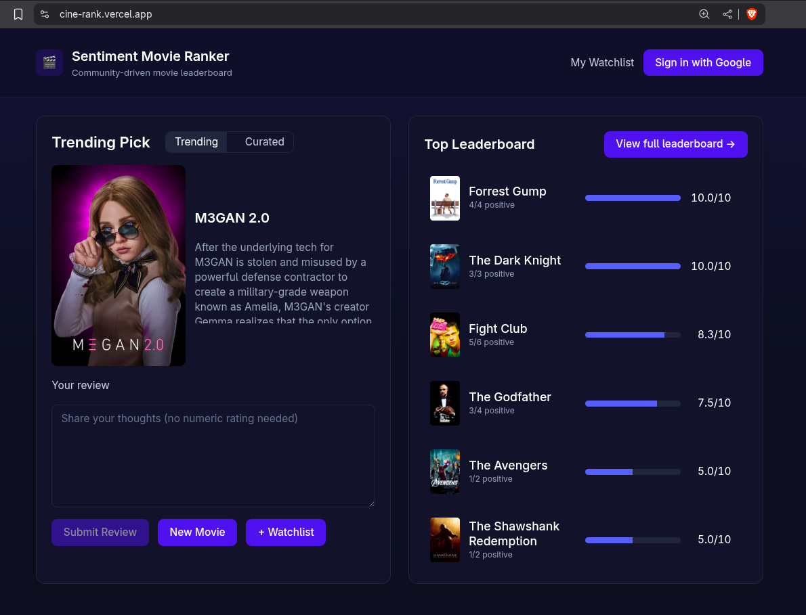

> **Live Demo:** [cine-rank.vercel.app](https://cine-rank.vercel.app)  
> **Source Code:** [cineRank GitHub](https://github.com/paudelsamir/cineRank)

# Community‑driven movie leaderboard with trending picks, sentiment reviews, and personal watchlists

*Project Log & Implementation Summary*

## Table of Contents

- [🌐 Phase 1: Data Setup & Cleaning](#phase-1-data-setup--cleaning)
  - [Data Loading](#data-loading)
  - [Basic Cleaning Pipeline](#basic-cleaning-pipeline)
  - [Text Analysis](#text-analysis)
- [🌐 Phase 2: Exploratory Data Analysis](#phase-2-exploratory-data-analysis)
  - [Dataset Overview](#dataset-overview)
  - [Target Variable Distribution](#target-variable-distribution)
  - [Text Length Analysis](#text-length-analysis)
  - [Word Cloud Visualization](#word-cloud-visualization)
- [🌐 Phase 3: Vectorization & Embeddings](#phase-3-vectorization--embeddings)
  - [Non-Semantic Vectors](#non-semantic-vectors)
  - [Pre-trained Embeddings](#pre-trained-embeddings)
  - [BERT Embeddings](#bert-embeddings)
- [🌐 Phase 4: BERT Fine-tuning](#phase-4-bert-fine-tuning)
  - [Prompt Engineering](#prompt-engineering)
- [🌐 Phase 5: Additional Features](#phase-5-additional-features)
  - [Interactive Movie & TV Ranking App](#interactive-movie--tv-ranking-app)
- [🌐 Phase 6: Deployment](#phase-6-deployment)
  - [Deployment Steps](#deployment)

## Phase 1: Data Setup & Cleaning

### Data Loading 
- [x] Downloaded IMDb 50K dataset from Kaggle/HuggingFace
- [x] Loaded dataset
- [x] Checked data shape and counts
- [x] Sampled reviews for manual inspection
- [x] Explored missing values and duplicates

### Basic Cleaning Pipeline
- [x] Installed required libraries
- [x] Removed duplicate rows
- [x] Implemented `remove_html_tags()` using BeautifulSoup
- [x] Implemented `remove_punctuation()` using regex
- [x] Implemented `remove_urls()` using regex
- [x] Implemented `remove_stopwords()` using NLTK/spaCy
- [x] Implemented `remove_emojis()` using regex
- [x] Implemented `expand_contractions()`
- [x] Chained all functions into `preprocess_text()` pipeline
- [x] Lemmatized words using spaCy/NLTK
- [x] Applied pipeline and saved as `cleaned_imdb.csv`

### Text Analysis
- [x] Counted words per review
- [x] Plotted word count distribution
- [x] Found top 50 frequent words
- [x] Created word frequency lists for positive/negative reviews
- [x] Built vocabulary dictionary

## Phase 2: Exploratory Data Analysis

> **Most steps were explored during data cleaning and preprocessing. This phase is separated for structure.**

### Dataset Overview
- [x] Checked data shape and structure
- [x] Checked for missing values
- [x] Identified and removed duplicates

### Target Variable Distribution
- [x] Plotted sentiment class distribution
- [x] Calculated class balance statistics

### Text Length Analysis
- [x] Plotted character and word count distributions
- [x] Plotted average word length distribution

### Word Cloud Visualization
- [x] Generated word clouds for positive/negative reviews

### Corpus Analysis
- [x] Extracted corpus from reviews
- [x] Computed frequency distribution of common words

### N-gram Analysis
- [x] Calculated unigram, bigram, trigram frequencies for both sentiments

### Basic Stats
- [x] Calculated average review length by sentiment
- [x] Counted unique words
- [x] Found longest and shortest reviews
- [x] Created length histogram
- [x] Calculated sentiment distribution

### Word Analysis
- [x] Installed textblob
- [x] Calculated sentiment scores
- [x] Extracted common bigrams
- [x] Created word clouds
- [x] Saved visualizations as PNG files

### Advanced EDA
- [x] Installed spacy model
- [x] Extracted POS tags
- [x] Counted adjectives/adverbs in reviews
- [x] Created correlation matrix between text features
- [x] Exported EDA summary to `eda_report.html`

---

## Phase 3: Vectorization & Embeddings 

### Non-Semantic Vectors
- [x] Implemented Bag of Words with `CountVectorizer`
- [x] Set vectorizer parameters
- [x] Transformed train/test data
- [x] Implemented TF-IDF with `TfidfVectorizer`
- [x] Compared BoW vs TF-IDF
- [x] Saved vectors as `.pkl` files

### Pre-trained Embeddings
- [x] Downloaded GloVe vectors
- [x] Loaded GloVe into dictionary
- [x] Created embedding matrix
- [x] Handled OOV words
- [x] Saved embedding matrix

### BERT Embeddings
- [x] Installed transformers and torch
- [x] Loaded BERT model and tokenizer
- [x] Implemented `get_bert_embeddings(texts)`
- [x] Processed reviews and saved embeddings

---

## Phase 4: BERT Fine-tuning

- [x] Created BERT classifier
- [x] Tokenized with BERT tokenizer
- [x] Used different learning rates for BERT/classifier
- [x] Trained for 3-5 epochs
- [x] Saved fine-tuned model

### Prompt Engineering
- [x] Installed OpenAI API
- [x] Created prompt templates
- [x] Tested few-shot prompting
- [x] Compared zero-shot vs few-shot
- [x] Saved results to JSON

---

## Phase 5: Additional Features

### Interactive Movie & TV Ranking App
- [x] Integrated TMDB API for trending titles
- [x] Built live leaderboard using sentiment analysis
- [x] Enabled watchlist support
- [x] Implemented real-time score updates
- [x] Deployed backend to Render and frontend to Vercel

---

## Phase 6: Deployment

- [x] Deployed backend API to Render
- [x] Deployed frontend web app to Vercel
- [x] Connected backend and frontend
- [x] Full source code and deployment instructions in repo

