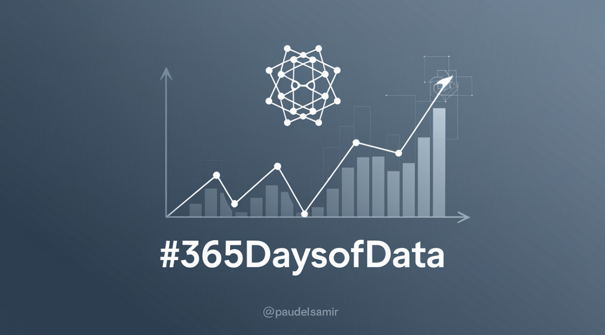

# 365DaysOfData
A repository for tracking my learning and progress with Data. 

Before starting this challenge, I already had [**intermediate proficiency**](https://github.com/paudelsamir/python-mastery) in **Python** and had worked on several basic to advanced [**EDA projects**](https://github.com/paudelsamir/EDA-Projects). I’m also familiar with **Statistics** and **Mathematics**, so now my goal is to revisit these topics with a **practical, data-driven focus**.
  
*And so, the #365DaysofData journey begins!*

## Progress

| **Day** | **Date**       | **Topics Learned**            | **Resources**                |
|---------|----------------|-------------------------------|------------------------------|
| [Day 1](logs/Day_001_to_010%20-%20Mathematics%20and%20Statistics/README.md) | 2024-12-14     | Basics of Linear Algebra  | [3blue1brown](https://www.3blue1brown.com/topics/linear-algebra) |
| [Day 2](logs/Day_001_to_010%20-%20Mathematics%20and%20Statistics/README.md) | 2024-12-15    | Decomposition, Derivatives Integration and Gradient descent      | [3blue1brown](https://www.3blue1brown.com/topics/calculus) |

| [Day XXX](logs/Day_001_to_010%20-%20Mathematics%20and%20Statistics/README.md) | YYYY-MM-DD     | XXXXXXXXXXXXXXXXXXXXXXX        | [Resource X](link) |
| [Day XXX](logs/Day_001_to_010%20-%20Mathematics%20and%20Statistics/README.md) | YYYY-MM-DD     | XXXXXXXXXXXXXXXXXXXXXXX        | [Resource X](link) |