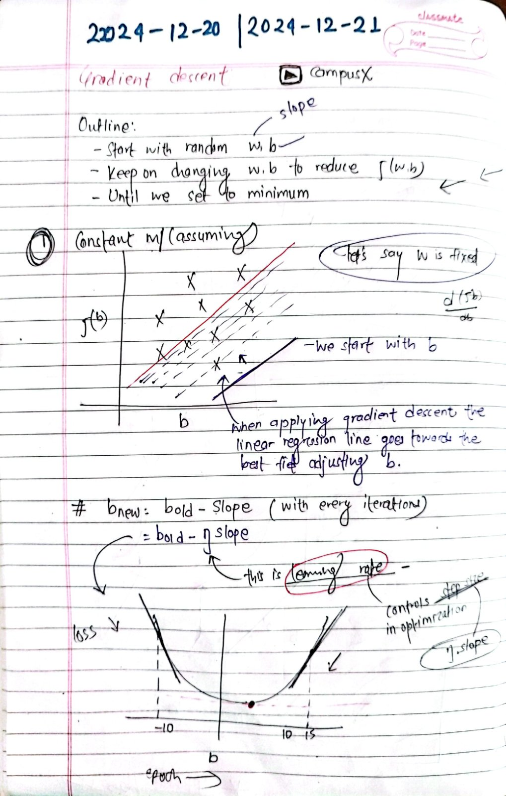
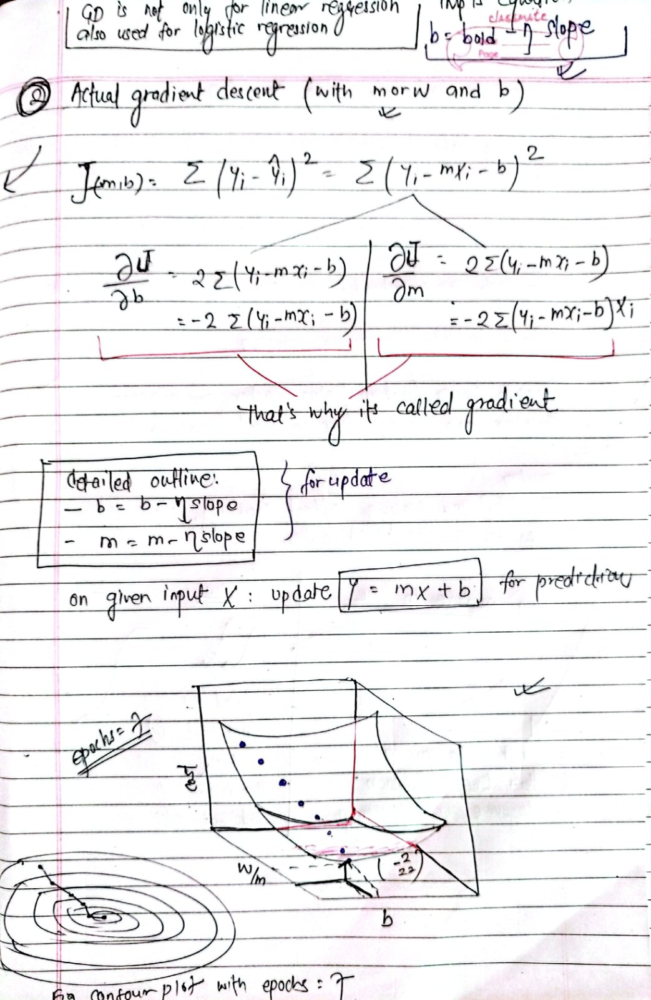
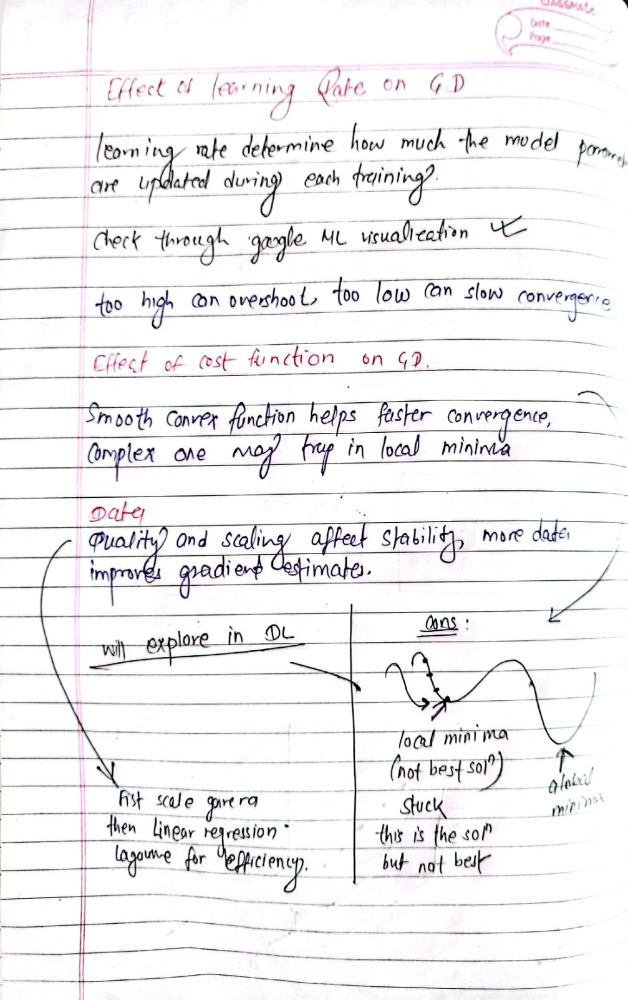

> Before starting this challenge, I already had [**intermediate proficiency**](https://github.com/paudelsamir/python-mastery) in **Python** and had worked on several basic to advanced [**EDA projects**](https://github.com/paudelsamir/EDA-Projects). I’m also familiar with Statistics and Mathematics.

 

Follow my journey with daily posts on [linkedin](https://www.linkedin.com/in/paudelsamir/)

| Books & Resources  | Completion Status |
|--------------------|-------------------|
| [Machine Learning Specialization @Coursera](https://www.coursera.org/specializations/machine-learning-introduction) | 🏊 |
| [Hands-On Machine Learning with Scikit-Learn and TensorFlow](https://github.com/yanshengjia/ml-road/blob/master/resources/Hands%20On%20Machine%20Learning%20with%20Scikit%20Learn%20and%20TensorFlow.pdf)| 🏊 |

 

# Progress
| Days | Date               | Topics                      | Resources    |
|------|--------------------|-----------------------------|--------------|
| [Day1](#day-01-setting-up--basics-of-linear-algebra) |2024-12-14 | Setting Up + Basics of Linear Algebra  | [3blue1brown](https://www.3blue1brown.com/topics/linear-algebra) |
| [Day2](#day-02-decomposition-derivation-integration-and-gradient-descent) | 2024-12-15 | Decomposition, Derivation, Integration, and Gradient Descent | [3blue1brown](https://www.3blue1brown.com/topics/calculus) |
| [Day3](#day-03-supervised-machine-learning-regression-and-classificaiton) | 2024-12-16 |Supervised Learning, Regression and classification|[Machine Learning Specialization](https://www.coursera.org/specializations/machine-learning-introduction) |
| [Day4](#day-04-unsupervised-learning-clustering-dimensionality-reduction) | 2024-12-17 |Unsupervised Learning: Clustering and dimensionality reduction|[Machine Learning Specialization](https://www.coursera.org/specializations/machine-learning-introduction) |
| [Day5](#day-05-univariate-linear-regression) | 2024-12-18 |Univariate linear Regression|[Machine Learning Specialization](https://www.coursera.org/specializations/machine-learning-introduction) |
| [Day6](#day-06-cost-function) | 2024-12-19 |Cost Functions|[Machine Learning Specialization](https://www.coursera.org/specializations/machine-learning-introduction) |
| [Day7](#day-07-gradient-descent) | 2024-12-20 |Gradient Descent|[CampusX](https://www.youtube.com/watch?v=ORyfPJypKuU), [Machine Learning Specialization](https://www.coursera.org/specializations/machine-learning-introduction) |
| [Day8](#day-08-effect-of-learning-rate-cost-function-and-data-on-gd) | 2024-12-21 |Effect of learning Rate, Cost function and Data on GD|[CampusX](https://www.youtube.com/watch?v=ORyfPJypKuU), [Machine Learning Specialization](https://www.coursera.org/specializations/machine-learning-introduction) |
| [DayX]() | YYYY-MM-DD |XXXXXXXXXXXXXXXXXXXXXXX| Resource X |

 

# Day 01: Setting Up + Basics of Linear Algebra

- Scalars, Vectors, Matrices, Tensors: Basic data structures for ML.
    

- Linear Combination and Span: Representing data points as weighted sums. Used in Linear Regression and neural networks.
    

- Determinants: Matrix invertibility, unique solutions in linear regression.

- Dot and Cross Product: Similarity (e.g., in SVMs) and vector transformations.
    

---

# Day 02: Decomposition, Derivation, Integration, and Gradient Descent

- Identity and Inverse Matrices: Solving equations (e.g., linear regression) and optimization (e.g., gradient descent).

- Eigenvalues and Eigenvectors: PCA, SVD, feature extraction; eigenvalues capture variance.
    

- Singular Value Decomposition (SVD): PCA, image compression, and collaborative filtering.

[Notes Here]()

### Calculus Overview:
- Functions & Graphs: Relationship between input (e.g., house size) and output (e.g., house price).

- Derivatives: Adjust model parameters to minimize error in predictions (e.g., house price).
    

- Partial Derivatives: Measure change with respect to one variable, used in neural networks for weight updates.

- Gradient Descent: Optimization to minimize the cost function (error).

- Optimization: Finding the best values (minima/maxima) of a function to improve predictions.

- Integrals: Calculate area under a curve, used in probabilistic models (e.g., Naive Bayes).
    

Revised statistics and probability concepts. Ready for the ML Specialization course!

---

# Day 03: Supervised Machine Learning: Regression and Classificaiton
<!-- [Notes credit](https://drive.google.com/file/d/1SO3WJZGSPx2jypBUugJkkwO8LZozBK7B/view?usp=sharing) -->
- Supervised Learning:  

- Regression: 

- Classification: 

---

# Day 04: Unsupervised Learning: Clustering, dimensionality reduction

data only comes with input x, but not output labels y. Algorithm has to find structure in data.

- Clustering: group similar data points together  

- dimensionality reduction: compress data using fewer numbers eg image compression 

- anomaly detection: find unusual data points eg fraud detection 

---

# Day 05: Univariate Linear Regression:
- Learned univariate linear regression and practiced building a model to predict house prices using size as input, including defining the hypothesis function, making predictions, and visualizing results.

[Notebook](./01-Supervised-Learning/code/day_04_model_representation.ipynb)

 - Univariate Linear Regression Quiz

---
# Day 06: Cost Function:
  

Visualization of cost function:

- manually reading these contour plot is not effective or correct, as the complexity increases, we need an algorithm which figures out the values w, b (parameters) to get the best fit time, minimizing cost function

*Gradient descent is an algorithm which does this task*
---

# Day 07: Gradient Descent
learned the basics by assuming slope constant and with only the vertical shift.
later learned GD with both the parameters w and b.

<!-- 
 -->
  

# Day 08: Effect of learning Rate, Cost function and Data on GD

- learning rate on GD:Affects the step size; too high can overshoot, too low can slow convergence

- cost function on GD:Smooth, convex functions help faster convergence; complex ones may trap in local minima

- Data on GD:Quality and scaling affect stability; more data improves gradient estimates