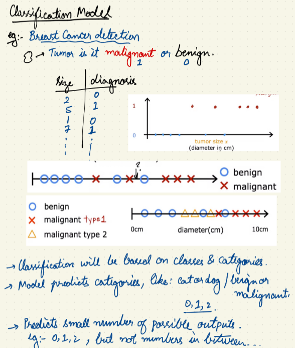
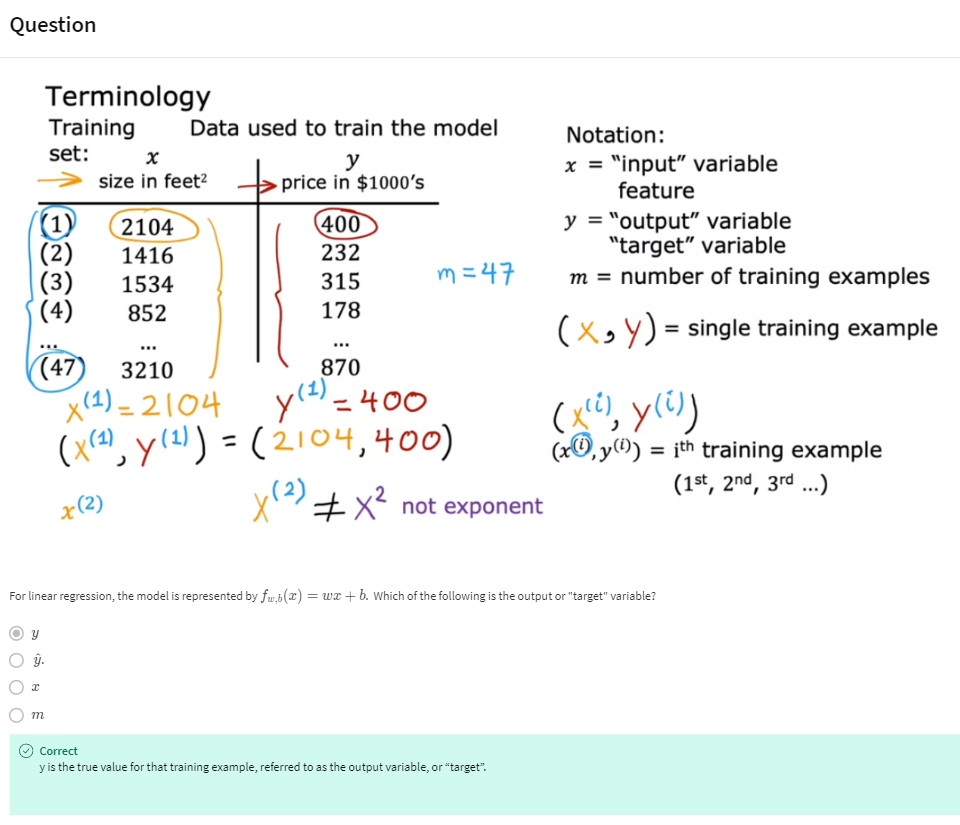
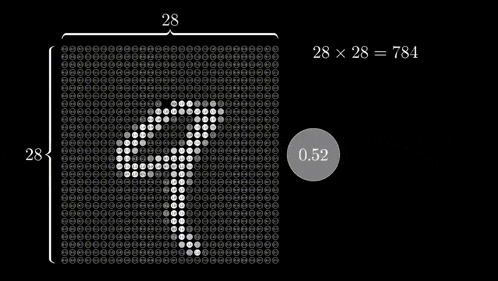

<div id="top"></div>
<div align="left">
  <!-- Left Badges (Last Updated & Repo Size) -->
  
  
  
</div>


> Before starting this challenge, I built [**intermediate proficiency**](https://github.com/paudelsamir/python-mastery) in **Python** through practice and [**EDA projects**](https://github.com/paudelsamir/EDA-Projects). I also spent a month exploring **Data Science**, logging my progress in the [**30DaysOfData**](https://github.com/paudelsamir/30DaysOfData-LearningUtsav) repository. With a solid foundation in Statistics and Mathematics, I’m excited to embark on this journey. Let’s begin!
<br>

I’ll be sharing updates regularly on [**LinkedIn**](https://www.linkedin.com/in/paudelsamir/).

<div align="right">
  <a href="#bottom" target="_blank">
    
  </a>
</div>


# Resources
| Books & Resources  | Completion Status |
|--------------------|-------------------|
| [Machine Learning Specialization @Coursera](https://www.coursera.org/specializations/machine-learning-introduction) | 🏊 |
| [100 Days ML @CampusX](https://www.youtube.com/playlist?list=PLKnIA16_Rmvbr7zKYQuBfsVkjoLcJgxHH) | 🏊 |
<!-- | [Hands-On Machine Learning with Scikit-Learn and TensorFlow](https://github.com/yanshengjia/ml-road/blob/master/resources/Hands%20On%20Machine%20Learning%20with%20Scikit%20Learn%20and%20TensorFlow.pdf)| 🏊 |  -->


# Progress
| Days | Date               | Topics                      | Resources    |
|------|--------------------|-----------------------------|--------------|
| [Day1](#day-01-basics-of-linear-algebra) |2024ᚑ12ᚑ14 | Setting Up + Basics of Linear Algebra  | [3blue1brown](https://www.3blue1brown.com/topics/linear-algebra) |
| [Day2](#day-02-decomposition-derivation-integration-and-gradient-descent) | 2024-12-15 | Decomposition, Derivation, Integration, and Gradient Descent | [3blue1brown](https://www.3blue1brown.com/topics/calculus) |
| [Day3](#day-03-supervised-machine-learning-regression-and-classificaiton) | 2024-12-16 |Supervised Learning, Regression and classification|[Machine Learning Specialization](https://www.coursera.org/specializations/machine-learning-introduction) |
| [Day4](#day-04-unsupervised-learning-clustering-dimensionality-reduction) | 2024-12-17 |Unsupervised Learning: Clustering and dimensionality reduction|[Machine Learning Specialization](https://www.coursera.org/specializations/machine-learning-introduction) |
| [Day5](#day-05-univariate-linear-regression) | 2024-12-18 |Univariate linear Regression|[Machine Learning Specialization](https://www.coursera.org/specializations/machine-learning-introduction) |
| [Day6](#day-06-cost-function) | 2024-12-19 |Cost Functions|[Machine Learning Specialization](https://www.coursera.org/specializations/machine-learning-introduction) |
| [Day7](#day-07-gradient-descent) | 2024-12-20 |Gradient Descent|[CampusX, ](https://www.youtube.com/watch?v=ORyfPJypKuU) [Machine Learning Specialization](https://www.coursera.org/specializations/machine-learning-introduction) |
| [Day8](#day-08-effect-of-learning-rate-cost-function-and-data-on-gd) | 2024-12-21 |Effect of learning Rate, Cost function and Data on GD|[CampusX, ](https://www.youtube.com/watch?v=ORyfPJypKuU) [Machine Learning Specialization](https://www.coursera.org/specializations/machine-learning-introduction) |
| [Day9](#day-09-linear-regression-with-multiple-features-vectorization) | 2024-12-22 |Linear Regression with multiple features, Vectorization| [Machine Learning Specialization](https://www.coursera.org/specializations/machine-learning-introduction) |
| [Day10](#day10-feature-scaling) | 2024-12-23 |Feature Scaling, Visualization of Multiple Regression and Polynomial Regression| [Machine Learning Specialization](https://www.coursera.org/specializations/machine-learning-introduction) |
| [Day11](#day-11-feature-engineering-and-polynomial-regression) | 2024-12-24 |Feature Engineering, Polynomial Regression| [Machine Learning Specialization](https://www.coursera.org/specializations/machine-learning-introduction) |
| [Day12](#day-12-linear-regression-using-scikit-learn) | 2024-12-25 |Scikit-Learn revision, Linear Regression using Scikit Learn| [Machine Learning Specialization](https://www.coursera.org/specializations/machine-learning-introduction) |
| [Day13](#day-13-classification) | 2024-12-26 |LR lab, Classification|[Machine Learning Specialization](https://www.coursera.org/specializations/machine-learning-introduction)|
| [Day14](#day-14-logistic-regression-sigmoid-function) | 2024-12-27 |Logistic Regression, Sigmoid Function|[Machine Learning Specialization](https://www.coursera.org/specializations/machine-learning-introduction) [, CampusX](https://www.youtube.com/watch?v=ABrrSwMYWSg&list=PLKnIA16_Rmvb-ZTsM1QS-tlwmlkeGSnru&index=6)|
| [Day15](#day-15-decision-boundary-cost-function) | 2024-12-28 |Decision Boundary, Cost Function|[Machine Learning Specialization](https://www.coursera.org/specializations/machine-learning-introduction) [, CampusX](https://www.youtube.com/watch?v=ABrrSwMYWSg&list=PLKnIA16_Rmvb-ZTsM1QS-tlwmlkeGSnru&index=6)|
| [Day16](#day-16-gradient-descent-for-logical-regression) | 2024-12-29 |Gradient Descent for logical regression|[Machine Learning Specialization](https://www.coursera.org/specializations/machine-learning-introduction) [, CampusX](https://www.youtube.com/watch?v=ABrrSwMYWSg&list=PLKnIA16_Rmvb-ZTsM1QS-tlwmlkeGSnru&index=6)|
| [Day17](#day-17-underfitting-overfitting) | 2024-12-30 |Underfitting, Overfitting, Regularization Polynomial Features, Hyperparameters|[Machine Learning Specialization](https://www.coursera.org/specializations/machine-learning-introduction)|
| [Day18](#day-18-neurons-layer-neural-netowrk-forward-propagation) | 2024-12-31 |Neurons, Neural Netowrk, Forward Propagation|[Machine Learning Specialization](https://www.coursera.org/specializations/machine-learning-introduction)|
| [Day19]() | 2025-01-01 |-------------------|[Machine Learning Specialization](https://www.coursera.org/specializations/machine-learning-introduction)|
| [Day20]() | 2025-01-02 |-------------------|[Machine Learning Specialization](https://www.coursera.org/specializations/machine-learning-introduction)|
| [Day21]() | 2025-01-03 |-------------------|[Machine Learning Specialization](https://www.coursera.org/specializations/machine-learning-introduction)|
| [Day22]() | 2025-01-04 |-------------------|[Machine Learning Specialization](https://www.coursera.org/specializations/machine-learning-introduction)|
| [Day23]() | 2025-01-05 |-------------------|[Machine Learning Specialization](https://www.coursera.org/specializations/machine-learning-introduction)|
| [Day24]() | 2025-01-06 |-------------------|[Machine Learning Specialization](https://www.coursera.org/specializations/machine-learning-introduction)|
| [Day25]() | 2025-01-07 |-------------------|[Machine Learning Specialization](https://www.coursera.org/specializations/machine-learning-introduction)|
| [Day26]() | 2025-01-08 |-------------------|[Machine Learning Specialization](https://www.coursera.org/specializations/machine-learning-introduction)|
| [Day27]() | 2025-01-09 |-------------------|[Machine Learning Specialization](https://www.coursera.org/specializations/machine-learning-introduction)|
| [Day28]() | 2025-01-10 |-------------------|[Machine Learning Specialization](https://www.coursera.org/specializations/machine-learning-introduction)|
| [Day29]() | 2025-01-11 |-------------------|[Machine Learning Specialization](https://www.coursera.org/specializations/machine-learning-introduction)|
| [Day30]() | 2025-01-12 |-------------------|[Machine Learning Specialization](https://www.coursera.org/specializations/machine-learning-introduction)|

---
<br>
<br>


# Day 01: Basics of Linear Algebra 
<!--  -->

<!-- 
 -->
linear algebra is used to represent data, perform matrix operations, and solve equations in algorithms like regression, pca, and neural networks.
- Scalars, Vectors, Matrices, Tensors: Basic data structures for ML.
    

- Linear Combination and Span: Representing data points as weighted sums. Used in Linear Regression and neural networks.
    

- Determinants: Matrix invertibility, unique solutions in linear regression.

- Dot and Cross Product: Similarity (e.g., in SVMs) and vector transformations.
    

*Slow progress right?? but consistent wins the race!*

---
# Day 02: Decomposition, Derivation, Integration, and Gradient Descent

- Identity and Inverse Matrices: Solving equations (e.g., linear regression) and optimization (e.g., gradient descent).

- Eigenvalues and Eigenvectors: PCA, SVD, feature extraction; eigenvalues capture variance.
    

- Singular Value Decomposition (SVD): PCA, image compression, and collaborative filtering.

[Notes Here]()

### Calculus Overview:
- Functions & Graphs: Relationship between input (e.g., house size) and output (e.g., house price).

- Derivatives: Adjust model parameters to minimize error in predictions (e.g., house price).
    

- Partial Derivatives: Measure change with respect to one variable, used in neural networks for weight updates.

- Gradient Descent: Optimization to minimize the cost function (error).

- Optimization: Finding the best values (minima/maxima) of a function to improve predictions.

- Integrals: Calculate area under a curve, used in probabilistic models (e.g., Naive Bayes).
    

Revised statistics and probability concepts. Ready for the ML Specialization course!

---
# Day 03: Supervised Machine Learning: Regression and Classificaiton
<!-- [Notes credit](https://drive.google.com/file/d/1SO3WJZGSPx2jypBUugJkkwO8LZozBK7B/view?usp=sharing) -->

- Supervised Learning: <br>


- Regression:<br>

- Classification:<br>



---
# Day 04: Unsupervised Learning: Clustering, dimensionality reduction

data only comes with input x, but not output labels y. Algorithm has to find structure in data.

- Clustering: group similar data points together <br>

- dimensionality reduction: compress data using fewer numbers eg image compression<br> 
<!--  -->
- anomaly detection: find unusual data points eg fraud detection<br>

---
# Day 05: Univariate Linear Regression:
- Learned univariate linear regression and practiced building a model to predict house prices using size as input, including defining the hypothesis function, making predictions, and visualizing results.

[Notebook: Model Representation](./01-Supervised-Learning/code/day04_model_representation.ipynb)

<!--  -->


 - Univariate Linear Regression Quiz



---
# Day 06: Cost Function:

Visualization of cost function:


- manually reading these contour plot is not effective or correct, as the complexity increases, we need an algorithm which figures out the values w, b (parameters) to get the best fit time, minimizing cost function

[Notebook: Model Representation](./01-Supervised-Learning/code/day04_model_representation.ipynb)

*Gradient descent is an algorithm which does this task*

---
# Day 07: Gradient Descent
[Notebook: Gradient descent](./01-Supervised-Learning/code/day07_gradient-descent-code-from-scratch.ipynb)


learned the basics by assuming slope constant and with only the vertical shift.
later learned GD with both the parameters w and b.

<!-- 
 -->
  

---
# Day 08: Effect of learning Rate, Cost function and Data on GD
- learning rate on GD:Affects the step size; too high can overshoot, too low can slow convergence

<!--  -->

<!--  -->
- cost function on GD:Smooth, convex functions help faster convergence; complex ones may trap in local minima

- Data on GD:Quality and scaling affect stability; more data improves gradient estimates

[Notebook: gradient descent animation 3d](./01-Supervised-Learning/code/day08_gradient-descent-animation(both-m-and-b).ipynb)

---
# Day 09: Linear Regression with multiple features, Vectorization

Predicts target using multiple features, minimizing error.
- Vectorization: Matrix operations replace loops for faster calculations.


[Lab1: Vectorization](./01-Supervised-Learning/code/day09_Python_Numpy_Vectorization_Soln.ipynb)
<br>

---
# Day10: Feature Scaling
[Lab2: Multiple Variable](./01-Supervised-Learning/code/day09_Lab02_Multiple_Variable_Soln.ipynb)

Today, I learned about feature scaling and how it helps improve predictions. There are multiple methods for feature scaling, including
- Min-Max Scaling
- Mean Normalization
- Z-Score Normalization

To ensure proper convergence:
check the learning curve to confirm the loss is decreasing.
Start with a small learning rate and gradually increase to find the optimal value.

 


---
# Day 11: Feature engineering and Polynomial Regression
feature engineering improves features to better predict the target.

eg If we need to predict the cost of flooring and have length and breadth of the room as features, we can use feature engineering to create a new feature, area (length × breadth), which directly impacts the flooring cost.


explored polynomial regression that models the relationship between variables as a polynomial curve instead of a straight line

**Equation:**  
y = b₀ + b₁x + b₂x² + ... + bₙxⁿ 
It is useful for capturing nonlinear relationships in data.


[Lab1: Feature Scaling and Learning Rate](01-Supervised-Learning/code/day11_Feature_Scaling_and_Learning_Rate_Soln.ipynb) <br>
[Lab2: Feature Engineering and PolyRegression](01-Supervised-Learning/code/day11_FeatEng_PolyReg_Soln.ipynb)

---
# Day 12: Linear Regression using Scikit Learn
Had a productive session with linear regression in scikit learn. The lab helped me get a better grasp of the process, though I need more practice with tuning models. Also revisited the Scikit-Learn models ,more comfortable with them now

- Scikit-learn is an open-source Python library used for machine learning that provides simple and efficient tools for data analysis, including algorithms for classification, regression, clustering, and dimensionality reduction.


 
 <br>
[Notebook: ScikitLearn GD](01-Supervised-Learning/code/day12_Sklearn_GD_Soln.ipynb)

---
# Day 13: Classification

[Notebook: Graded Lab](./01-Supervised-Learning/code/day13_Linear_Regression_Lab.ipynb) 

<br>
[Notebook: Classification solution](./01-Supervised-Learning/code/day13_Classification_Soln.ipynb)

- Classification is the process of categorizing items into different groups based on shared characteristics, like classifying tumors into benign (non-cancerous) and malignant (cancerous) based on their growth behavior and potential to spread.

The example above demonstrates that the linear model is insufficient to model categorical data. The model can be extended as described in the following lab.

---
# Day 14: Logistic Regression, Sigmoid Function

- Logistic Regression: A classification algorithm used to predict probabilities of binary outcomes.

- Sigmoid Function: A mathematical function that maps any input to a value between 0 and 1, used in logistic regression to model probabilities.
 

[Notebook: Sigmoid Function](01-Supervised-Learning/code/day14_Sigmoid_function_Soln.ipynb)

---
# Day 15: Decision Boundary, Cost Function
[Notebook: Cost Function ](01-Supervised-Learning/code/day16_Cost_Function_Soln.ipynb)
- Decision Boundary: A line or surface that separates different classes in a classification problem based on the model’s predictions.
- cost function:


 
[Notebook: Decision boundary](01-Supervised-Learning/code/day15_Decision_Boundary_Soln.ipynb)

[Notebook Logistic Loss ](01-Supervised-Learning/code/day16_LogisticLoss_Soln.ipynb)

---
# Day 16: Gradient Descent for Logical Regression

[Notebook: Gradient Descent Model implementation](01-Supervised-Learning/code/day16_Gradient_Descent_Soln.ipynb)

[Notebook: GD with Scikit-learn](01-Supervised-Learning/code/day16_Scikit_Learn_Soln.ipynb)

Learned logistic regression cost, gradient descent, and sigmoid derivatives through step-by-step derivations and comparisons with linear regression.


---
# Day 17: Underfitting, Overfitting


Today, explored teh concepts, overfitting (high variance), underfitting (high bias) and generalization(just right). 
Regularization to reduce Overfitting. Explored Regularized logistic regression.
- If the data is in non linear behaviour then we have to appply Ml algos like decision tree, random forest and svm.

Explored hypermeters of logistic regression, and gained some knowledge.
 


[Notebook:Overfitting Solution ](01-Supervised-Learning/code/day17_Overfitting_Soln.ipynb)


[Notebook:Regularization ](01-Supervised-Learning/code/day17_regularization.ipynb)
 


---
# Day 18: Neurons, Layer, Neural netowrk, forward propagation
- neural network: 
neural networks are machine learning algorithms that model complex patterns using multiple hidden layers and non-linear activation functions. they take inputs, pass them through hidden layers of neurons, and output a prediction.
 

- Neurons:
a neuron takes weighted inputs, applies an activation function, and outputs a result. inputs can be features or outputs from previous neurons, with weights adjusting their influence.

fig: single neuron in action

- Synapse: 
synapses connect neurons and carry the weighted inputs. each connection has a weight that adjusts during training.

- weights: 
weights control the strength of connections between neurons. they are multiplied by inputs to influence the output, and are adjusted during training.

Popular activation functions include relu and sigmoid.

- Bias: 
bias is a constant added to the weighted input before applying the activation function, helping the model represent patterns that don’t pass through the origin.

- Layers: 
 
  - **input layer**: holds the data for the model, with each neuron representing an attribute.
  - **hidden layer**: applies activation functions to the inputs and passes results to the next layer.
  - **output layer**: receives input from the last hidden layer and returns the model’s prediction.


---
# Day 19: Forward Propagation
- Forward Propagation: Input data is “forward propagated” through the network layer by layer to the final layer which outputs a prediction.
``` python
# x is the input to the network. 
def relu(z):
    return max(0,z)

def feed_forward(x, Wh, Wo):
    # Hidden layer
    Zh = x * Wh
    H = relu(Zh)

    # Output layer
    Zo = H * Wo
    output = relu(Zo)
    return output

```

Notes for today:
 

 

Matrix Representation:
 
How forward Prop works for digit classification??

[Notebook: Neurons and Layers](02-Advanced-Learning-Algorithms/code/day19_Neurons_and_Layers.ipynb) 
[Notebook: A small Neural Netowrk using tensoflow](02-Advanced-Learning-Algorithms/code/day19_NN_CoffeeRoasting_TF.ipynb)


- **tensorflow basics**:
    - **representation of data**:numpy arrays used for input (e.g., 2D arrays).
        
        ```python
        python
        Copy code
        x = np.array([[1, 2, 3], [4, 5, 6]])
        
        ```
        
    - **building a neural network**:
        1. define layers:
            
            ```python
            python
            Copy code
            layer1 = dense(units=25, activation='sigmoid')
            layer2 = dense(units=15, activation='sigmoid')
            layer3 = dense(units=1, activation='sigmoid')
            
            ```
            
        2. stack layers in a model:
            
            ```python
            python
            Copy code
            model = sequential([layer1, layer2, layer3])
            
            ```
            
        3. compile and train:
            
            ```python
            python
            Copy code
            model.compile(optimizer='adam', loss='binary_crossentropy')
            model.fit(x, y, epochs=10)
            
            ```
            
    - **visualization**:neurons connect layer by layer, with weights and biases computed at each step (refer to attached gif).

    
<div id="bottom"></div>
<div align="right">
  <a href="#top" target="_blank">
    
  </a>
</div>
