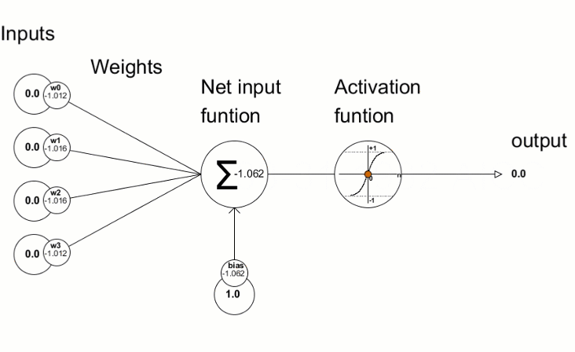
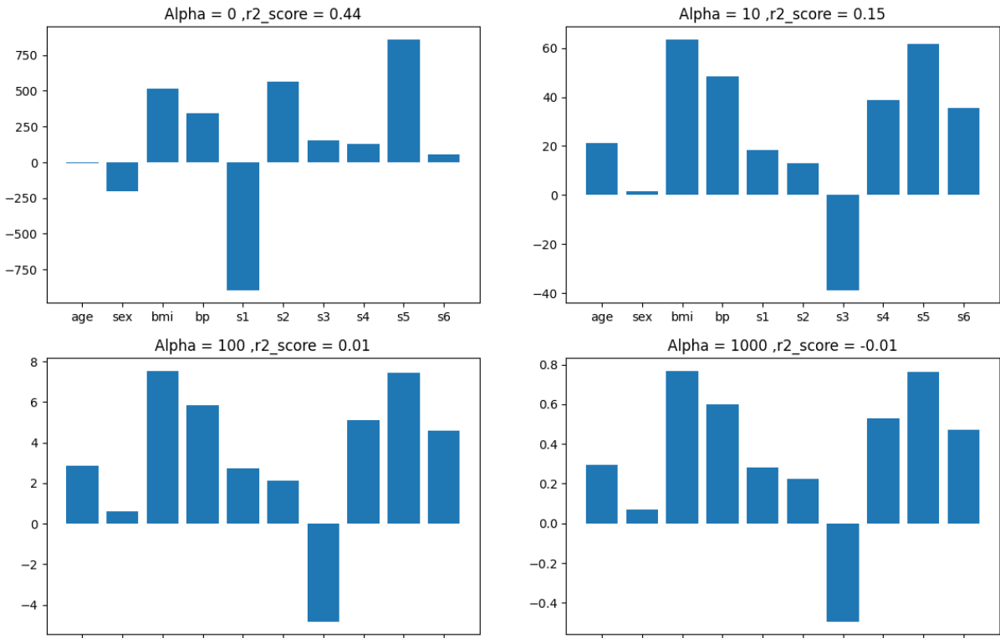
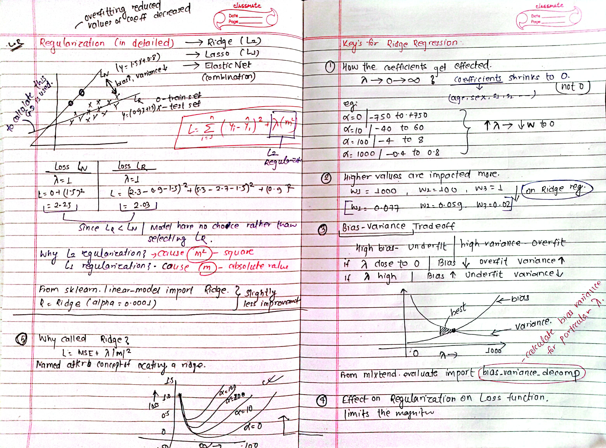
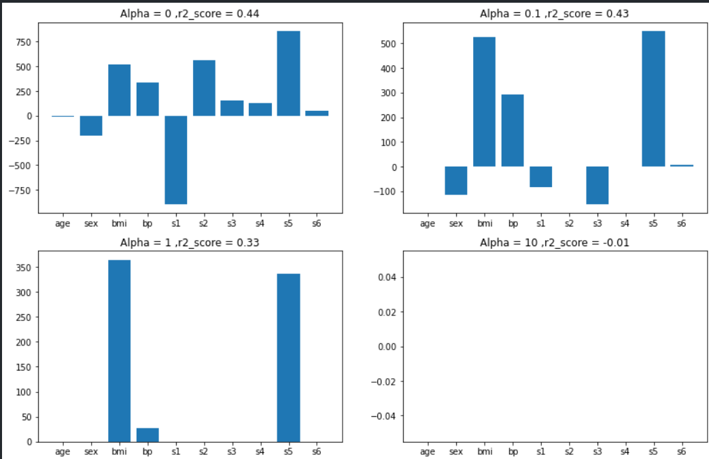
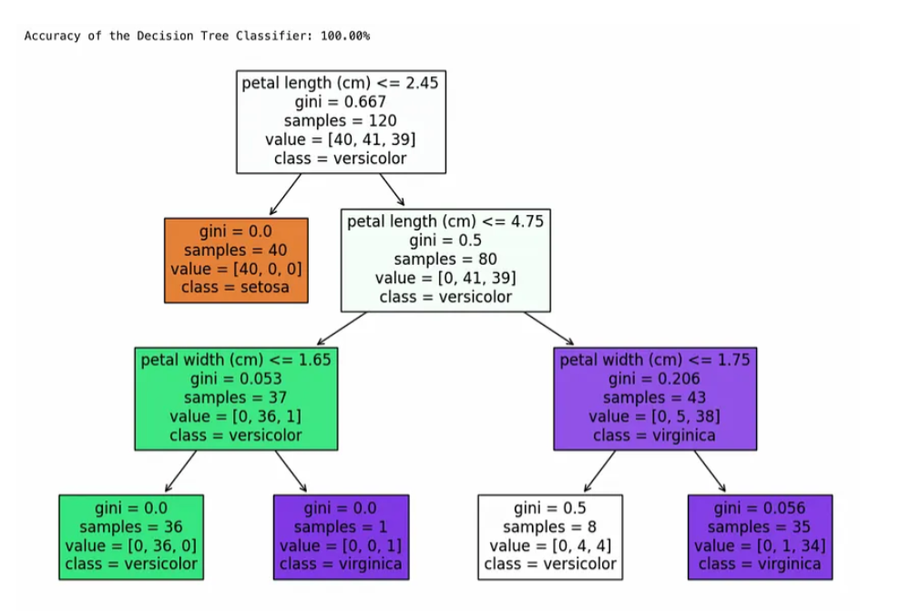
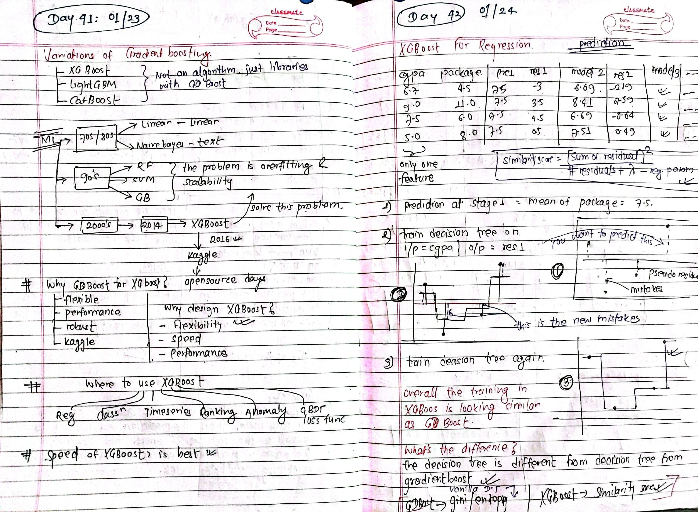

<div id="top"></div>
<div align="left">
  <!-- Left Badges (Last Updated & Repo Size) -->
  
  
  
</div>


> Before starting this challenge, I built [**intermediate proficiency**](https://github.com/paudelsamir/python-mastery) in **Python** through practice and [**EDA projects**](https://github.com/paudelsamir/EDA-Projects). I also spent a month exploring **Data Science**, logging my progress in the [**30DaysOfData**](https://github.com/paudelsamir/30DaysOfData-LearningUtsav) repository. With a solid foundation in Statistics and Mathematics, I’m excited to embark on this journey. Let’s begin!
<br>

I’ll be sharing updates regularly on [**LinkedIn**](https://www.linkedin.com/in/paudelsamir/).

<div align="right">
  <a href="#bottom" target="_blank">
    
  </a>
</div>


# Resources
| Books & Resources  | Completion Status |
|--------------------|-------------------|
| [Machine Learning Specialization @Coursera](https://www.coursera.org/specializations/machine-learning-introduction) | 🏊 |
| [100 Days ML @CampusX](https://www.youtube.com/playlist?list=PLKnIA16_Rmvbr7zKYQuBfsVkjoLcJgxHH) | 🏊 |
<!-- | [Hands-On Machine Learning with Scikit-Learn and TensorFlow](https://github.com/yanshengjia/ml-road/blob/master/resources/Hands%20On%20Machine%20Learning%20with%20Scikit%20Learn%20and%20TensorFlow.pdf)| 🏊 |  -->


# Progress
| Days | Date               | Topics                      | Resources    |
|------|--------------------|-----------------------------|--------------|
| [Day1](#day-01-basics-of-linear-algebra) |2024ᚑ12ᚑ14 | Setting Up + Basics of Linear Algebra  | [3blue1brown](https://www.3blue1brown.com/topics/linear-algebra) |
| [Day2](#day-02-decomposition-derivation-integration-and-gradient-descent) | 2024-12-15 | Decomposition, Derivation, Integration, and Gradient Descent | [3blue1brown](https://www.3blue1brown.com/topics/calculus) |
| [Day3](#day-03-supervised-machine-learning-regression-and-classificaiton) | 2024-12-16 |Supervised Learning, Regression and classification|[Machine Learning Specialization](https://www.coursera.org/specializations/machine-learning-introduction) |
| [Day4](#day-04-unsupervised-learning-clustering-dimensionality-reduction) | 2024-12-17 |Unsupervised Learning: Clustering and dimensionality reduction|[Machine Learning Specialization](https://www.coursera.org/specializations/machine-learning-introduction) |
| [Day5](#day-05-univariate-linear-regression) | 2024-12-18|Univariate linear Regression|[Machine Learning Specialization](https://www.coursera.org/specializations/machine-learning-introduction) |
| [Day6](#day-06-cost-function) | 2024-12-19 |Cost Functions|[Machine Learning Specialization](https://www.coursera.org/specializations/machine-learning-introduction) |
| [Day7](#day-07-gradient-descent) | 2024-12-20 |Gradient Descent|[CampusX, ](https://www.youtube.com/watch?v=ORyfPJypKuU) [Machine Learning Specialization](https://www.coursera.org/specializations/machine-learning-introduction) |
| [Day8](#day-08-effect-of-learning-rate-cost-function-and-data-on-gd) | 2024-12-21 |Effect of learning Rate, Cost function and Data on GD|[CampusX, ](https://www.youtube.com/watch?v=ORyfPJypKuU) [Machine Learning Specialization](https://www.coursera.org/specializations/machine-learning-introduction) |
| [Day9](#day-09-linear-regression-with-multiple-features-vectorization) | 2024-12-22 |Linear Regression with multiple features, Vectorization| [Machine Learning Specialization](https://www.coursera.org/specializations/machine-learning-introduction) |
| [Day10](#day10-feature-scaling) | 2024-12-23 |Feature Scaling, Visualization of Multiple Regression and Polynomial Regression| [Machine Learning Specialization](https://www.coursera.org/specializations/machine-learning-introduction) |
| [Day11](#day-11-feature-engineering-and-polynomial-regression) | 2024-12-24 |Feature Engineering, Polynomial Regression| [Machine Learning Specialization](https://www.coursera.org/specializations/machine-learning-introduction) |
| [Day12](#day-12-linear-regression-using-scikit-learn) | 2024-12-25 |Scikit-Learn revision, Linear Regression using Scikit Learn| [Machine Learning Specialization](https://www.coursera.org/specializations/machine-learning-introduction) |
| [Day13](#day-13-classification) | 2024-12-26 |LR lab, Classification|[Machine Learning Specialization](https://www.coursera.org/specializations/machine-learning-introduction)|
| [Day14](#day-14-logistic-regression-sigmoid-function) | 2024-12-27 |Logistic Regression, Sigmoid Function|[Machine Learning Specialization](https://www.coursera.org/specializations/machine-learning-introduction) [, CampusX](https://www.youtube.com/watch?v=ABrrSwMYWSg&list=PLKnIA16_Rmvb-ZTsM1QS-tlwmlkeGSnru&index=6)|
| [Day15](#day-15-decision-boundary-cost-function) | 2024-12-28 |Decision Boundary, Cost Function|[Machine Learning Specialization](https://www.coursera.org/specializations/machine-learning-introduction) [, CampusX](https://www.youtube.com/watch?v=ABrrSwMYWSg&list=PLKnIA16_Rmvb-ZTsM1QS-tlwmlkeGSnru&index=6)|
| [Day16](#day-16-gradient-descent-for-logical-regression) | 2024-12-29 |Gradient Descent for logical regression|[Machine Learning Specialization](https://www.coursera.org/specializations/machine-learning-introduction) [, CampusX](https://www.youtube.com/watch?v=ABrrSwMYWSg&list=PLKnIA16_Rmvb-ZTsM1QS-tlwmlkeGSnru&index=6)|
| [Day17](#day-17-underfitting-overfitting) | 2024-12-30 |Underfitting, Overfitting, Regularization Polynomial Features, Hyperparameters|[Machine Learning Specialization](https://www.coursera.org/specializations/machine-learning-introduction)|
| [Day18](#day-18-neurons-layer-neural-netowrk-forward-propagation) | 2024-12-31 |Neurons, Neural Netowrk, Forward Propagation|[Machine Learning Specialization](https://www.coursera.org/specializations/machine-learning-introduction)|
| [Day19](#day-19-forward-propagation) | 2025-01-01 |Forward Propagation, Tensorflow implementations|[Machine Learning Specialization](https://www.coursera.org/specializations/machine-learning-introduction)|
| [Day20](#day-20-python-implementation-from-scratch) | 2025-01-02 |Building and comparing models (Binary Classification)|[Machine Learning Specialization](https://www.coursera.org/specializations/machine-learning-introduction)|
| [Day21](#day-21-vectorization-model-training) | 2025-01-03 |Vectorization, Model training using Tensoflow|[Machine Learning Specialization](https://www.coursera.org/specializations/machine-learning-introduction)|
| [Day22](#day-22-activation-functions-softmax) | 2025-01-04 |Activation Functions, Softmax Intution|[Machine Learning Specialization](https://www.coursera.org/specializations/machine-learning-introduction)|
| [Day23](#day-23-implementation-of-softmax-regression) | 2025-01-05 |Implementing Softmax|[Machine Learning Specialization](https://www.coursera.org/specializations/machine-learning-introduction)|
| [Day24](#day-24-backpropagation---what-and-how-) | 2025-01-06 |Backpropagaton, What and how??|[Machine Learning Specialization](https://www.coursera.org/specializations/machine-learning-introduction)|
| [Day25](#day-25-backpropagation---why-advices-for-applying-machine-learning) | 2025-01-07 |Backpropagation - Why? Advices for applying machine Learning|[Machine Learning Specialization](https://www.coursera.org/specializations/machine-learning-introduction)|
| [Day26](#day-26-model-selection-and-trainingcross-validationtest-sets-bias-and-variance) | 2025-01-08 |Model selection, training test, cross validation, Bias and Variance, Learning curves|[Machine Learning Specialization](https://www.coursera.org/specializations/machine-learning-introduction)|
| [Day27](#day-27-machine-learning-development-process-ml-workflow) | 2025-01-09 |Machine Learning Development Process, ML workflow|[Machine Learning Specialization](https://www.coursera.org/specializations/machine-learning-introduction)|
| [Day28](#day-28-machine-learning-model-error-analysis-and-transfer-learning) | 2025-01-10 |Implementing ML model: Error Analysis and Transfer Learning|[Notebook: Implementation, ](02-Advanced-Learning-Algorithms/code/day28_implementation.ipynb)[Machine Learning Specialization](https://www.coursera.org/specializations/machine-learning-introduction)|
| [Day29](#day-29-error-metrices-encoding-of-categorical-data-transoformers) | 2025-01-11 |Error Metrices, Encoding of Categorical Data, Transoformers|[Machine Learning Specialization](https://www.coursera.org/specializations/machine-learning-introduction) [, CampusX](https://www.youtube.com/watch?v=8osKeShYVRQ&list=PLKnIA16_Rmvbr7zKYQuBfsVkjoLcJgxHH&index=65)|
| [Day30](#day-30-scikit-learn-pipelines--ridge-regression-l2-regularization) | 2025-01-12 | Scikit-Learn Pipelines & Ridge Regression (L2 Regularization) |[Documentation: Scikit-Learn](https://scikit-learn.org/1.5/modules/linear_model.html)  [, CampusX](https://www.youtube.com/watch?v=8osKeShYVRQ&list=PLKnIA16_Rmvbr7zKYQuBfsVkjoLcJgxHH&index=65)|
| [Day31](#day-31-lasso-regression-l1-regularization-elastic-net-regularization) | 2025-01-13 | Lasso Regression (L1 Regularization), Elastic Net Regularization |[ML playlist @CampusX](https://www.youtube.com/playlist?list=PLKnIA16_Rmvbr7zKYQuBfsVkjoLcJgxHH)|
| [Day32](#day-32-decision-tree-entropy-and-information-gain) | 2025-01-14 | Decision Tree Emtropy and Information Gain |[ML playlist @CampusX](https://www.youtube.com/playlist?list=PLKnIA16_Rmvbr7zKYQuBfsVkjoLcJgxHH)|
| [Day33](#day-33-hyperparameters-of-dt-with-sclearn-regression-trees) | 2025-01-15 | Hyperparameters of Decision Tree with Scikit Learn, Regression Trees |[ML playlist @CampusX](https://www.youtube.com/playlist?list=PLKnIA16_Rmvbr7zKYQuBfsVkjoLcJgxHH) [, Visualize Yourself>>](https://decisiontreeclassifier.streamlit.app/)|
| [Day34](#day-34-visualization-using-dtreeviz-ensemble-learning-overview) | 2025-01-16 | Visualization Using DtreeViz(), Ensemble Learning |[Github Repo: Dtreeviz, ](https://github.com/parrt/dtreeviz) [ML playlist @CampusX](https://www.youtube.com/playlist?list=PLKnIA16_Rmvbr7zKYQuBfsVkjoLcJgxHH)|
| [Day35](#day-35-voting-ensemble--classification-and-regression) | 2025-01-17 | Voting Ensemble >> Classification and Regression |[ML playlist @CampusX](https://www.youtube.com/playlist?list=PLKnIA16_Rmvbr7zKYQuBfsVkjoLcJgxHH) [, Visualize Yourself](https://votingclassifier.streamlit.app/)|
| [Day36](#day-36-bagging-ensemble--classification-and-regression) | 2025-01-18 |  Bagging Ensemble > Classification and Regression |[ML playlist @CampusX](https://www.youtube.com/playlist?list=PLKnIA16_Rmvbr7zKYQuBfsVkjoLcJgxHH)|
| [Day37](#day-37-random-forest-intution-working-and-difference-with-bagging-random-forest-hyperparameters) | 2025-01-19 | Random Forest: Intution, Working and difference with bagging, Random Forest Hyperparameters |[ML playlist @CampusX](https://www.youtube.com/playlist?list=PLKnIA16_Rmvbr7zKYQuBfsVkjoLcJgxHH)|
| [Day38](#day-38-boosting-ensemble-adaboost-boosting) | 2025-01-20 |  Boosting Ensemble: Adaboost Boosting |[ML playlist @CampusX](https://www.youtube.com/playlist?list=PLKnIA16_Rmvbr7zKYQuBfsVkjoLcJgxHH)|
| [Day39](#day-39-understanding-gradientboosting-with-regression) | 2025-01-21 |  Understanding GradientBoosting with Regression |[ML playlist @CampusX](https://www.youtube.com/playlist?list=PLKnIA16_Rmvbr7zKYQuBfsVkjoLcJgxHH)|
| [Day40](#day-40-gradient-boosting-with-classification) | 2025-01-22 | Gradient Boosting with Classification|[ML playlist @CampusX](https://www.youtube.com/playlist?list=PLKnIA16_Rmvbr7zKYQuBfsVkjoLcJgxHH) [, Vlog Link](https://towardsdatascience.com/all-you-need-to-know-about-gradient-boosting-algorithm-part-2-classification-d3ed8f56541e)|
| [Day41](#day-41-variations-of-gradient-boosting-xgboost---introduction) | 2025-01-23 | XGboost Introduction |[ML playlist @CampusX](https://www.youtube.com/playlist?list=PLKnIA16_Rmvbr7zKYQuBfsVkjoLcJgxHH)|
| [Day42](#day-42-xgboost-for-regression-and-classification-catboost-vs-xgboost-vs-lightgbm) | 2025-01-24 | XGBoost for Regression and Classification, Catboost Vs XGboost Vs LightGBM |[ML playlist @CampusX](https://www.youtube.com/playlist?list=PLKnIA16_Rmvbr7zKYQuBfsVkjoLcJgxHH) [,Research Paper](https://www.kdd.org/kdd2016/papers/files/rfp0697-chenAemb.pdf)|
| [Day43]() | 2025-01-25 | ----------------- |[ML playlist @CampusX](https://www.youtube.com/playlist?list=PLKnIA16_Rmvbr7zKYQuBfsVkjoLcJgxHH)|
| [Day44]() | 2025-01-26 | ----------------- |[ML playlist @CampusX](https://www.youtube.com/playlist?list=PLKnIA16_Rmvbr7zKYQuBfsVkjoLcJgxHH)|
| [Day45]() | 2025-01-27 | ----------------- |[ML playlist @CampusX](https://www.youtube.com/playlist?list=PLKnIA16_Rmvbr7zKYQuBfsVkjoLcJgxHH)|
| [Dayxx]() | 2025-01-28 | ----------------- |[ML playlist @CampusX](https://www.youtube.com/playlist?list=PLKnIA16_Rmvbr7zKYQuBfsVkjoLcJgxHH)|
<!-- | [Day36]() | 2025-01-18 |  |[]() []()|
| [Day37]() | 2025-01-19 |  |[]() []()|
| [Day38]() | 2025-01-20 |  |[]() []()|
| [Day39]() | 2025-01-21 |  |[]() []()|
| [Day40]() | 2025-01-22 |  |[]() []()| -->


---
<br>
<br>


# Day 01: Basics of Linear Algebra 
<!--  -->

<!-- 
 -->
linear algebra is used to represent data, perform matrix operations, and solve equations in algorithms like regression, pca, and neural networks.
- Scalars, Vectors, Matrices, Tensors: Basic data structures for ML.
    

- Linear Combination and Span: Representing data points as weighted sums. Used in Linear Regression and neural networks.
    

- Determinants: Matrix invertibility, unique solutions in linear regression.

- Dot and Cross Product: Similarity (e.g., in SVMs) and vector transformations.
    

*Slow progress right?? but consistent wins the race!*

---
# Day 02: Decomposition, Derivation, Integration, and Gradient Descent

- Identity and Inverse Matrices: Solving equations (e.g., linear regression) and optimization (e.g., gradient descent).

- Eigenvalues and Eigenvectors: PCA, SVD, feature extraction; eigenvalues capture variance.
    

- Singular Value Decomposition (SVD): PCA, image compression, and collaborative filtering.

[Notes Here]()

### Calculus Overview:
- Functions & Graphs: Relationship between input (e.g., house size) and output (e.g., house price).

- Derivatives: Adjust model parameters to minimize error in predictions (e.g., house price).
    

- Partial Derivatives: Measure change with respect to one variable, used in neural networks for weight updates.

- Gradient Descent: Optimization to minimize the cost function (error).

- Optimization: Finding the best values (minima/maxima) of a function to improve predictions.

- Integrals: Calculate area under a curve, used in probabilistic models (e.g., Naive Bayes).
    

Revised statistics and probability concepts. Ready for the ML Specialization course!

---
# Day 03: Supervised Machine Learning: Regression and Classificaiton
<!-- [Notes credit](https://drive.google.com/file/d/1SO3WJZGSPx2jypBUugJkkwO8LZozBK7B/view?usp=sharing) -->

- Supervised Learning: <br>


- Regression:<br>

- Classification:<br>


---
# Day 04: Unsupervised Learning: Clustering, dimensionality reduction

data only comes with input x, but not output labels y. Algorithm has to find structure in data.

- Clustering: group similar data points together <br>

- dimensionality reduction: compress data using fewer numbers eg image compression<br> 
<!--  -->
- anomaly detection: find unusual data points eg fraud detection<br>

---
# Day 05: Univariate Linear Regression:
- Learned univariate linear regression and practiced building a model to predict house prices using size as input, including defining the hypothesis function, making predictions, and visualizing results.

[Notebook: Model Representation](./01-Supervised-Learning/code/day04_model_representation.ipynb)

<!--  -->


 - Univariate Linear Regression Quiz


---
# Day 06: Cost Function:

Visualization of cost function:


- manually reading these contour plot is not effective or correct, as the complexity increases, we need an algorithm which figures out the values w, b (parameters) to get the best fit time, minimizing cost function

[Notebook: Model Representation](./01-Supervised-Learning/code/day04_model_representation.ipynb)

*Gradient descent is an algorithm which does this task*

---
# Day 07: Gradient Descent
[Notebook: Gradient descent](./01-Supervised-Learning/code/day07_gradient-descent-code-from-scratch.ipynb)


learned the basics by assuming slope constant and with only the vertical shift.
later learned GD with both the parameters w and b.

<!-- 
 -->
  

---
# Day 08: Effect of learning Rate, Cost function and Data on GD
- learning rate on GD:Affects the step size; too high can overshoot, too low can slow convergence

<!--  -->

<!--  -->
- cost function on GD:Smooth, convex functions help faster convergence; complex ones may trap in local minima

- Data on GD:Quality and scaling affect stability; more data improves gradient estimates

[Notebook: gradient descent animation 3d](./01-Supervised-Learning/code/day08_gradient-descent-animation(both-m-and-b).ipynb)

---
# Day 09: Linear Regression with multiple features, Vectorization

Predicts target using multiple features, minimizing error.
- Vectorization: Matrix operations replace loops for faster calculations.


[Lab1: Vectorization](./01-Supervised-Learning/code/day09_Python_Numpy_Vectorization_Soln.ipynb)
<br>

---
# Day10: Feature Scaling
[Lab2: Multiple Variable](./01-Supervised-Learning/code/day09_Lab02_Multiple_Variable_Soln.ipynb)

Today, I learned about feature scaling and how it helps improve predictions. There are multiple methods for feature scaling, including
- Min-Max Scaling
- Mean Normalization
- Z-Score Normalization

To ensure proper convergence:
check the learning curve to confirm the loss is decreasing.
Start with a small learning rate and gradually increase to find the optimal value.

 


---
# Day 11: Feature engineering and Polynomial Regression
feature engineering improves features to better predict the target.

eg If we need to predict the cost of flooring and have length and breadth of the room as features, we can use feature engineering to create a new feature, area (length × breadth), which directly impacts the flooring cost.


explored polynomial regression that models the relationship between variables as a polynomial curve instead of a straight line

**Equation:**  
y = b₀ + b₁x + b₂x² + ... + bₙxⁿ 
It is useful for capturing nonlinear relationships in data.


[Lab1: Feature Scaling and Learning Rate](01-Supervised-Learning/code/day11_Feature_Scaling_and_Learning_Rate_Soln.ipynb) <br>
[Lab2: Feature Engineering and PolyRegression](01-Supervised-Learning/code/day11_FeatEng_PolyReg_Soln.ipynb)

---
# Day 12: Linear Regression using Scikit Learn
Had a productive session with linear regression in scikit learn. The lab helped me get a better grasp of the process, though I need more practice with tuning models. Also revisited the Scikit-Learn models ,more comfortable with them now

- Scikit-learn is an open-source Python library used for machine learning that provides simple and efficient tools for data analysis, including algorithms for classification, regression, clustering, and dimensionality reduction.


 
 <br>
[Notebook: ScikitLearn GD](01-Supervised-Learning/code/day12_Sklearn_GD_Soln.ipynb)

---
# Day 13: Classification

[Notebook: Graded Lab](./01-Supervised-Learning/code/day13_Linear_Regression_Lab.ipynb) 

<br>
[Notebook: Classification solution](./01-Supervised-Learning/code/day13_Classification_Soln.ipynb)

- Classification is the process of categorizing items into different groups based on shared characteristics, like classifying tumors into benign (non-cancerous) and malignant (cancerous) based on their growth behavior and potential to spread.

The example above demonstrates that the linear model is insufficient to model categorical data. The model can be extended as described in the following lab.

---
# Day 14: Logistic Regression, Sigmoid Function

- Logistic Regression: A classification algorithm used to predict probabilities of binary outcomes.

- Sigmoid Function: A mathematical function that maps any input to a value between 0 and 1, used in logistic regression to model probabilities.
 

[Notebook: Sigmoid Function](01-Supervised-Learning/code/day14_Sigmoid_function_Soln.ipynb)

---
# Day 15: Decision Boundary, Cost Function
[Notebook: Cost Function ](01-Supervised-Learning/code/day16_Cost_Function_Soln.ipynb)
- Decision Boundary: A line or surface that separates different classes in a classification problem based on the model’s predictions.
- cost function:


 
[Notebook: Decision boundary](01-Supervised-Learning/code/day15_Decision_Boundary_Soln.ipynb)

[Notebook Logistic Loss ](01-Supervised-Learning/code/day16_LogisticLoss_Soln.ipynb)

---
# Day 16: Gradient Descent for Logical Regression

[Notebook: Gradient Descent Model implementation](01-Supervised-Learning/code/day16_Gradient_Descent_Soln.ipynb)

[Notebook: GD with Scikit-learn](01-Supervised-Learning/code/day16_Scikit_Learn_Soln.ipynb)

Learned logistic regression cost, gradient descent, and sigmoid derivatives through step-by-step derivations and comparisons with linear regression.


---
# Day 17: Underfitting, Overfitting


Today, explored teh concepts, overfitting (high variance), underfitting (high bias) and generalization(just right). 
Regularization to reduce Overfitting. Explored Regularized logistic regression.
- If the data is in non linear behaviour then we have to appply Ml algos like decision tree, random forest and svm.

Explored hypermeters of logistic regression, and gained some knowledge.
 


[Notebook:Overfitting Solution ](01-Supervised-Learning/code/day17_Overfitting_Soln.ipynb)


[Notebook:Regularization ](01-Supervised-Learning/code/day17_regularization.ipynb)
 


---
# Day 18: Neurons, Layer, Neural netowrk, forward propagation
- neural network: 
neural networks are machine learning algorithms that model complex patterns using multiple hidden layers and non-linear activation functions. they take inputs, pass them through hidden layers of neurons, and output a prediction.
 

- Neurons:
a neuron takes weighted inputs, applies an activation function, and outputs a result. inputs can be features or outputs from previous neurons, with weights adjusting their influence.

fig: single neuron in action

- Synapse: 
synapses connect neurons and carry the weighted inputs. each connection has a weight that adjusts during training.

- weights: 
weights control the strength of connections between neurons. they are multiplied by inputs to influence the output, and are adjusted during training.

Popular activation functions include relu and sigmoid.

- Bias: 
bias is a constant added to the weighted input before applying the activation function, helping the model represent patterns that don’t pass through the origin.

- Layers: 
 
  - **input layer**: holds the data for the model, with each neuron representing an attribute.
  - **hidden layer**: applies activation functions to the inputs and passes results to the next layer.
  - **output layer**: receives input from the last hidden layer and returns the model’s prediction.


---
# Day 19: Forward Propagation
- Forward Propagation: Input data is “forward propagated” through the network layer by layer to the final layer which outputs a prediction.


Notes for today:
 

 

Matrix Representation:
 
How forward Prop works for digit classification??

[Notebook: Neurons and Layers](02-Advanced-Learning-Algorithms/code/day19_Neurons_and_Layers.ipynb) 
[Notebook: A small Neural Netowrk using tensoflow](02-Advanced-Learning-Algorithms/code/day19_NN_CoffeeRoasting_TF.ipynb)


- **tensorflow basics**:
    - **representation of data**:numpy arrays used for input (e.g., 2D arrays).
        
        ```python
        x = np.array([[1, 2, 3], [4, 5, 6]])
        
        ```
        
    - **building a neural network**:
        1. define layers:
            
            ```python
            layer1 = dense(units=25, activation='sigmoid')
            layer2 = dense(units=15, activation='sigmoid')
            layer3 = dense(units=1, activation='sigmoid')
            
            ```
            
        2. stack layers in a model:
            
            ```python
            model = sequential([layer1, layer2, layer3])
            
            ```
            
        3. compile and train:
            
            ```python
            model.compile(optimizer='adam', loss='binary_crossentropy')
            model.fit(x, y, epochs=10)
            
            ```
            
    - **visualization**:neurons connect layer by layer, with weights and biases computed at each step (refer to attached gif).

---
# Day 20: Python Implementation from Scratch

Implemented forward propagation to compute predictions and backpropagation to optimize weights for binary classification.
- AGI: An advanced AI capable of generalizing across tasks like humans.


[Notebook: Building Models](02-Advanced-Learning-Algorithms/code/day20_BuildingForwardPropagation.ipynb)

---
# Day 21: Vectorization, Model Training
Exploredd Vectorization for efficient computation
- Tensorflow: model.compile, binary_crossentropy, model.fit
trained a binary classification model and tested its accuracy

 
Training Model with tensorflow:

Notes for today:


---
# Day 22: Activation Functions, Softmax
*the universal approximation theorem explains that a neural network with enough hidden neurons and non-linear activations like sigmoid or relu can approximate almost any function, even complex patterns like wavy graphs.*

#### Activation Functions:
commonly used activation functions include:
- sigmoid: squashes values between 0 and 1, often used for binary classification.
- relu: outputs 0 for negatives and the input itself for positives, commonly used in hidden layers.
- tanh: outputs between -1 and 1, useful for centered data.


for multiclass classification, softmax is ideal in the output layer as it converts logits into probabilities that sum to 1. during training, the model adjusts weights to maximize the correct class probability, using categorical cross-entropy loss. softmax generalizes logistic regression, which is typically used for binary classification. in both, activation and loss functions differ based on the output type.


Logistic Vs softmax:


Notes:

 

---
# Day 23: Implementation of Softmax Regression

- Classification with multiple Outputs:
PS: there's difference between multiclass classificaiton and multilabel classification
[Notebook: Softmax/Multinomial in Iris dataset- Multilabel](02-Advanced-Learning-Algorithms/code/day23_softmax_demo.ipynb)

> *NOTE: softmax regression is a classification algorithm that calculates probabilities for multiple classes using a linear combination of inputs and the softmax function. the class with the highest probability is chosen as the prediction*

Improved Implementation of Softmax:


Tensorflow implementation:
```python
model = Sequential(
    [ 
        Dense(25, activation = 'relu'),
        Dense(15, activation = 'relu'),
        Dense(4, activation = 'softmax')    # < softmax activation here

        ##         Dense(4, activation = 'linear')   #<-- Note
    ]
)
model.compile(
    loss=tf.keras.losses.SparseCategoricalCrossentropy(),
    ##     loss=tf.keras.losses.SparseCategoricalCrossentropy(from_logits=True),  #<-- Note ---- This is preferred model softmax and loss are combined for more accurate result.
    optimizer=tf.keras.optimizers.Adam(0.001),
)

model.fit(
    X_train,y_train,
    epochs=10
)
    
```

---
# Day 24: Backpropagation - what and how ?
- what? Backpropagation adjusts nneural network weights by propagating errors backward using the chain rule and optimizing them with gradient descent.
- how? Forward pass to compute outputs, Calculate errors, propagate them backward, and update weights iteratively. Take a look at document below.

Backpropagation example with Neural Network:


[Notebook: Backprop](02-Advanced-Learning-Algorithms/code/day25_Backprop.ipynb)

[pdf- How to implement??](02-Advanced-Learning-Algorithms/backpropagation_how.pdf)

*Notes:*

 
---
# Day 25: Backpropagation - Why? Advices for applying machine Learning

Today, I dived into the reasons behind backpropagation's effectiveness in training neural networks. It's not just about adjusting weights; it's the gradients that guide optimization, helping the model minimize error and improve predictions. The backpropagation process makes sure that the error gets distributed in a way that leads to better learning.

*How????*
- **Gradients**: they ensure efficient error minimization by guiding weight updates.
- **Optimization**: properly tuned gradients lead to smoother optimization and faster convergence.
- **Model Evaluation**: evaluating model performance becomes easier with backpropagation because of the systematic error propagation and weight adjustments.

*Notes:*


---
# Day 26: Model selection and training/cross validation/test sets, Bias and Variance

mnist dataset: Label and our prediction after training

Errors in our prediction:
 
- the importance of splitting data into training, validation, and test sets 
cross-validation and its role in hyperparameter tuning.
- Diagnosing bias and variance with error trends: high bias = underfit, high variance = overfit.
- regulariaztion to handle the tradeoff between bias and variance.
- how learning curves reveal insights about model performance and whether gathering more data will help.
 

Notes: 


[Notebook: Practice Lab: Neural Networks for Handwritten Digit Recognition, Multiclass](02-Advanced-Learning-Algorithms/code/day25_NN_multiclass_mnist.ipynb)

[Notebook: Diagnosing Bias and Variance](02-Advanced-Learning-Algorithms/code/day26_Diagnosing_Bias_and_Variance.ipynb) 

[Notebook: Model Evaluation and selection](02-Advanced-Learning-Algorithms/code/day26_Model_Evaluation_and_Selection.ipynb)

---
# Day 27: Machine Learning Development Process, ML workflow
machine learning development process  

1. ml development is iterative, involving:  
   - choosing model and data architecture.  
   - training the model.  
   - diagnosing bias, variance, and errors.  


2. error analysis: identify and fix patterns in model failures.  
3. adding data:  
   - data augmentation: modify existing data (e.g., distortions).  
   - data synthesis: create artificial data.  
4. transfer learning:  
   - reuse pre-trained models for similar tasks.  
   - fine-tune them with your own data.  
  

5. ml projects follow these steps:  
   - data collection.  
   - preprocessing.  
   - modeling.  
   - evaluation.  
   - deployment.  
   
   - monitoring.  


6. ethics and fairness -  
    ensure ethical use by:  
   - avoiding biased decisions in loans, jobs, etc.  
   - preventing harmful applications like deepfakes. 

Notes:


---
# Day 28: Machine Learning Model: Error Analysis and Transfer Learning

[Notebook: Code Implementation from Scratch](02-Advanced-Learning-Algorithms/code/day28_implementation.ipynb)

- *Confusion Matrix Analysis:* the most frequent error is misclassifying 5 as 3. overall, the error rate is around 8%.


- *Iterations Insight:* after 200 iterations, the error rate does not decrease significantly, suggesting that 200 iterations are enough for the model to converge.


- *Data Augmentation Insight:* despite applying data augmentation, there was no improvement in accuracy. this is because the MNIST dataset is already preprocessed, with centered and normalized images, making the augmentation techniques less effective. in general, data augmentation works best when the dataset is smaller or images are not preprocessed.


- *Transfer Learning with MobileNetV2:* 
  - Training set accuracy improved from 56.95% to 73.02%.
  - Validation accuracy increased from 70.52% to 74.06%.
  - Loss decreased consistently for both training and validation sets, signaling better learning and generalization.
  - The model shows significant improvement over epochs. 
  - Using transfer learning, the model started with an initial accuracy of 74% (pre-trained on ImageNet). As training progressed, the model continued to adapt, improving with each epoch. transfer learning was effective, yielding good results with fewer epochs.


---
# Day 29: Error Metrices, Encoding of Categorical Data, Transoformers

[Notebook: Lab week 3: Improving Model ](02-Advanced-Learning-Algorithms/code/day29_improvingML_models.ipynb) 

[Notebook: Error Metrics ](02-Advanced-Learning-Algorithms/code/day29_error_metrics.ipynb)
### Precision vs. Recall Trade-Off: 

- High Precision:
Only hire candidates you’re sure are good.
Result: Fewer bad hires, but you might miss some great ones.
Example: You hire 5 people, all are good, but you missed 10 other good ones.
- High Recall:
Hire as many as possible to ensure no good candidate is missed.
Result: You catch all great candidates but end up with some bad hires too.
Example: You hire 50 people, 20 are good, but 30 are bad.
- When to Focus on Each?
1. Precision: When mistakes (bad hires) are costly.
Example: Hiring a brain surgeon.

2. Recall: When missing good candidates is worse.
Example: Hiring for a customer service team.


#### Encoding of Categoriical Data:

| **Encoding Type** | **Use When** | **Example** |
| --- | --- | --- |
| **Label Encoding** | Small, unordered categories | Colors: `[Red, Blue]` |
| **Ordinal Encoding** | Ordered categories | Education: `[Low, High]` |
| **One-Hot Encoding** | Nominal data, fewer unique categories | Days: `[Mon, Tue, Wed]` |
<br>

#### Types of Transformers: 

| **Transformer** | **Purpose** | **Example Use Case** | **Input** | **Output** |
| --- | --- | --- | --- | --- |
| **Column Transformer** | Apply different transformations to different columns (e.g., scaling and encoding). | Scale age and one-hot encode city names. | `Age: [25, 35, 45]`, `City: [NY, LA, CHI]` | `[-1.22, 0, 0, 1]`, `[0, 1, 0, 0]`, `[1.22, 0, 1, 0]` |
| **Function Transformer** | Apply a mathematical function (e.g., log or sqrt) to all values. | Apply logarithmic transformation to data. | `[1, 10, 100]` | `[0.69, 2.39, 4.61]` |
| **Power Transformer** | Normalize and reduce skewness in data, making it more Gaussian-like. | Stabilize variance in highly skewed data. | `[1, 10, 100]` | `[-1.22, 0.0, 1.22]` |

---
# Day 30: Scikit-Learn Pipelines & Ridge Regression (L2 Regularization) 

I explored how to create pipelines in Scikit-learn to streamline the process of combining multiple steps (like preprocessing, model fitting, and regularization) into a single object. This simplifies workflows and ensures reproducibility.

There are three techniques of regularization:
- Ridge (L2)
- Lasso (L1)
- Elastic Net (Combination)

#### Key Understanding of Ridge Regression:
 1. How the coefficient Get affected?
 - Regularization shrinks the coefficients, preventing them from becoming too large, which reduces overfitting.
 
 2. Higher Values are impacted more
 - The larger the regularization value (alpha), the more the coefficients are reduced.
 
 3. Impact on Bias Variance Tradeoff
 - Higher regularization increases bias but reduces variance, making the model more generalizable.
 
 4. Effect on Loss Function
 - adds a penalty term that limits the magnitude of the coefficients.
 
 5. Why Ridge Regression is called so?
 - Named after the concept of creating a "ridge" or constraint on the model’s coefficients, preventing them from growing too large.

 

Notes:

 

[Notebook: Key Understandings of ridge Regression](02-Advanced-Learning-Algorithms/code/day30_visualizing_ridgeregression_key_understanding.ipynb)

---
# Day 31: Lasso Regression (L1 Regularization), Elastic Net Regularization 

#### Lasso Regression:
1. **How are coefficients affected by λ (alpha)?**
    As λ increases, regularization strength grows, shrinking less important coefficients to **exactly zero**. Larger λ values lead to feature selection by removing irrelevant features.
    
    
2. **Are higher coefficients affected more?**
    No. Lasso affects **smaller coefficients more**, shrinking them to zero first. Larger coefficients remain relatively unaffected if they contribute significantly to the model.
    
    
3. **Impact of λ on bias and variance**:
    - **Higher λ** increases bias (simpler model) and reduces variance.
    - **Lower λ** reduces bias (complex model) but increases variance.
    

4. **Effect of Regularization on Loss Function**:
    - Lasso add λ sum(w_i) to the loss, promoting sparsity by penalizing the absolute magnitude of coefficients. Unlike Ridge, it can remove features entirely, improving interpretability.
    

#### Elastic Net Regularization:
Elastic Net combines L1 (Lasso) and L2 (Ridge) penalties. It selects important features by shrinking some coefficients to zero (like Lasso) and handles correlated features by shrinking coefficients without setting them to zero (like Ridge). It’s useful when features are both highly correlated and some are irrelevant. Elastic Net is controlled by two parameters: 
α (mix of Lasso and Ridge) and 
λ (regularization strength).


Notes:


---
# Day 32: Decision Tree: Entropy and Information Gain
A decision tree is a flowchart-like structure used for classification or regression, where data is split into branches based on conditions until a final decision (leaf) is reached.


- Decision Tree on Categorical Variables: Splits data based on categories like "Sunny" or "Rainy".
- Decision Tree on Numerical Variables: Splits data using thresholds like Age > 30.
- How Decision Tree Works: Repeatedly splits data into smaller groups based on conditions.
- Terminology: Root (start), Branch (path), Leaf (decision).
-  Pro - Simple to understand; Con - Can overfit.
- Entropy: Measures uncertainty; low entropy = purer data.
- Entropy Calculation: ```∑ p(x) * log2(p(x)).```
- Information Gain: Reduction in entropy after splitting data. ``` IG=Entropy(before)−Weighted Entropy(after)``` 
- Gini Impurity: Measures group purity, faster than entropy.
- Why Use Gini Over Entropy: Simpler and computationally faster.

Notes;


---
# Day 33: Hyperparameters of DT with sclearn, Regression Trees:


Studied hyperparameters of Decision Trees in Scikit-learn and techniques to handle overfitting and underfitting.
- Criterion (gini, entropy, log loss): Determines the quality of a split.
- Splitter: Helps reduce overfitting with better random splits.
- Max Depth: Controls tree depth; too high causes overfitting, too low causes underfitting.
- Min Sample Split: Sets the minimum samples required to split a node.
- Min Sample Leaf: Sets the minimum samples per leaf.
- Max Features: Determines how many features to use for splits.
- Max Leaf Nodes: Limits the number of leaf nodes.
- Min Impurity Decrease: Controls splitting based on impurity reduction.

A Regression Tree predicts continuous variables by splitting data to minimize variance. The best split is determined by maximizing variance reduction, calculated as the variance of the root node minus the weighted average variance of the leaf nodes.


Code:
 
Output:



---
# Day 34: Visualization Using dtreeviz, Ensemble Learning Overview

[Notebook: Visualization of Decision Tree Official](02-Advanced-Learning-Algorithms/code/day34_dtreeviz_sklearn_visualisations.ipynb) 
[Notebook: Visualization of Decision Tree ](02-Advanced-Learning-Algorithms/code/day34_dtreeviz_sklearn_pipeline_visualisations.ipynb)

- started learning about ensemble learning:
understood the concept of "wisdom of the crowd" in ensemble methods.
types of ensemble methods: voting, bagging, boosting, and stacking.
overview of random forest and bootstrapped aggregation (bagging).
learned how boosting adjusts predictions iteratively.

Visuals of Bagging, boosting and stacking:
 
Notes;


---
# Day 35: Voting Ensemble > Classification and Regression

- Soft voting: logistic regression: 60% fraud, random forest: 80% fraud, svm: 40% fraud 
→ final probability: (60% + 80% + 40%) / 3 = 60%. 


- Hard voting: majority wins, logistic regression predicts "fraud," random forest predicts "not fraud," and svm predicts "fraud" → final prediction: "fraud."


Conclusions from [Notebook: voting Classifier](02-Advanced-Learning-Algorithms/code/day35_votingClassifier.ipynb)

- weighted voting: assigning weights to classifiers helps emphasize stronger models, further improving performance.

- same algorithm, different hyperparameters: tweaking hyperparameters (e.g., kernel degree in SVM) can lead to significant accuracy changes, highlighting the value of hyperparameter optimization.
#### Classification:
```python

voting_clf = VotingClassifier(
    estimators=[
        ('lr', log_reg),  # logistic regression: good for linear patterns
        ('rf', rand_forest),  # random forest: captures complex relationships
        ('svc', svm_clf)  # support vector machine: handles edge cases
    ],
    voting='soft',  # averages probabilities from all models for final prediction
    weights=[2, 1, 1],  # gives higher importance to logistic regression
    n_jobs=-1  # enables parallel processing for faster training
)


```
What to use? soft voting or hard voting, depends if possible use both and then try to find out:
 

#### Regression:
- voting regressor combines multiple regression models to predict continuous values.

similarly, in regression, soft voting averages continuous predictions, and weighted voting helps models with higher performance contribute more.


Visualize voting regression here: [link](https://votingclassifier.streamlit.app/)

``` python
voting_reg = VotingRegressor(
    estimators=[
        ('lr', lin_reg),  # linear regression: good for linear relationships
        ('rf', rand_forest_reg),  # random forest regressor: handles non-linear patterns
        ('svr', svr_clf)  # support vector regressor: captures complex relationships
    ],
    weights=[2, 1, 1],  # assigns higher importance to linear regression
    n_jobs=-1  # enables parallel processing for faster training
)

```

---
# Day 36: Bagging Ensemble > Classification and Regression

- bagging (bootstrap aggregating) is an ensemble learning technique that combines predictions from multiple models trained on different subsets of the data (created via bootstrapping) to improve accuracy and reduce variance.

- Intution: 

    
    - random sampling: create multiple datasets by sampling with replacement from the original dataset.
    - train independently: train a model (single preferred) on each bootstrapped dataset (e.g., decision trees).
    - combine predictions: aggregate their predictions by majority voting (classification) or averaging (regression).
    this reduces overfitting and increases stability, especially for high-variance models.

[Notebook: Bagging Intution](02-Advanced-Learning-Algorithms/code/day36_bagging_demo.ipynb)

#### Classification:
- Intution

- Code Demo
``` python
from sklearn.ensemble import BaggingClassifier
from sklearn.tree import DecisionTreeClassifier

# initialize the bagging classifier
bagging_model = BaggingClassifier(
    base_estimator=DecisionTreeClassifier(),  # base model for ensemble; here, decision trees
    n_estimators=10,                          # number of base models to train
    max_samples=1.0,                          # fraction of the dataset for each base model (1.0 = 100%)
    max_features=1.0,                         # fraction of features used in each bootstrap sample
    bootstrap=True,                           # sample datasets with replacement (True enables bootstrapping)
    bootstrap_features=False,                 # sample features with replacement (False = no feature bootstrapping)
    random_state=42                           # seed for reproducibility
)


```

#### Regression:
- Intution:

- Code Demo:
``` python
bagging_model = BaggingRegressor(
    base_estimator=DecisionTreeRegressor(),  # base model for ensemble; here, decision trees
    n_estimators=10,                          # number of base models to train
    max_samples=1.0,                          # fraction of the dataset for each base model (1.0 = 100%)
    max_features=1.0,                         # fraction of features used in each bootstrap sample
    bootstrap=True,                           # sample datasets with replacement (True enables bootstrapping)
    bootstrap_features=False,                 # sample features with replacement (False = no feature bootstrapping)
    random_state=42                           # seed for reproducibility
)

```

---
# Day 37: Random Forest: Intution, Working and difference with bagging, Random Forest Hyperparameters

random forest is like a bunch of decision trees making a group decision. each tree gets a vote on the outcome, and the most votes win. it's like asking a bunch of experts for advice and going with the majority.

Sampling Techniques:
- row sampling
- column sampling
- combination

[Notebook Random Forest](02-Advanced-Learning-Algorithms/code/day37_RandomForest.ipynb)

#### Random Forest vs bagging:

- why random forest performs well: it reduces overfitting by averaging multiple decision trees trained on different random subsets of data and features, improving accuracy and robustness.

- random forest vs bagging: both use multiple trees, but random forest adds feature randomness at each split, making trees less correlated and boosting performance.


[Notebook: Random forest Vs bagging](02-Advanced-Learning-Algorithms/code/day37_randomForestVsBagging.ipynb)

#### Random forest Hyperparameters:
``` python

model = RandomForestClassifier(
    # core hyperparameters
    n_estimators=100,         # number of decision trees in the forest
    max_features="sqrt",      # max features to consider at each split
    max_depth=None,           # max depth of each tree; None = grow fully
    min_samples_split=2,      # min samples needed to split a node
    min_samples_leaf=1,       # min samples required in a leaf node
    bootstrap=True,           # with replacement or without replacement

    # advanced hyperparameters
    max_leaf_nodes=None,      # max number of leaf nodes per tree; None = unlimited
    min_weight_fraction_leaf=0.0,  # min fraction of total weight for a leaf node
    class_weight=None,        # weights for handling class imbalance (e.g., 'balanced')
    ccp_alpha=0.0,            # complexity parameter for pruning; trade-off between size and accuracy
    criterion="gini",         # metric to evaluate splits: "gini" (default) or "entropy"
    warm_start=False,         # reuse previous trees for incremental training; False = train from scratch
    oob_score=False,          # whether to use out-of-bag samples to estimate generalization accuracy
    verbose=0,                # verbosity of output (0 = silent)
    n_jobs=-1,                # number of CPU cores for parallel processing; -1 = use all cores
    random_state=42           # seed for reproducibility
)

```
---
# Day 38: Boosting Ensemble: Adaboost Boosting

- boosting is a sequential ensemble learning method where models correct the errors of previous models to reduce bias.
combines weak learners (like decision stumps) to create a strong predictive model.


Notes:


#### AdaBoost Exploration:

step-by-step understanding of adaboost’s workflow, including:
- calculating sample weights and weak learner errors.
- updating model contributions based on performance.
- final prediction via weighted majority vote.
- visualized how adaboost focuses on difficult samples.

implemented adaboost from scratch without using sklearn.


[Notebook: Adaboost Implementation](02-Advanced-Learning-Algorithms/code/day38_adaboost_from_scratch.ipynb)


---
# Day 39: Understanding GradientBoosting with Regression:

 "a model that learns step-by-step by fixing the mistakes of the previous model."
 
 

- Comparision between Adaboost and Gradietn boost:


 > boosting + gradients (gradients = direction to minimize error).

``` 
pseudo-  residual = actual - predicted
new prediction = old prediction + (learning_rate × residual)
```


- Practice:  [Notebook: gradient boosting regressor using scikit learn](02-Advanced-Learning-Algorithms/code/day39_gradient_boosting_regressor.ipynb)

#### gradient boosting variations:
- xgboost: uses regularization and handles missing data efficiently.
- lightgbm: faster with large datasets.
- catboost: great for categorical data.

```python
    gb = GradientBoostingRegressor(
        n_estimators=100,      # number of trees
        learning_rate=0.1,     # step size for updates
        max_depth=3,           # depth of each tree
        min_samples_split=2,   # min samples to split a node
        min_samples_leaf=1,    # min samples per leaf
        subsample=1.0,         # fraction of samples per tree
        max_features=None,     # use all features
        random_state=42        # ensures reproducibility
    )
```

Notes:


---
# Day 40: Gradient Boosting with Classification

## Overview
- Gradient boosting improves classification by minimizing log-loss iteratively.
- Each tree focuses on correcting errors made by previous trees.
- Uses gradients of the loss function to guide updates.

#### Algorithm
1. Initialize predictions: `F0(x)` (log-odds for classification).
2. For each iteration:
   - Compute pseudo-residuals:  
     `ri = - ∂(loss) / ∂F(xi)`
   - Fit a weak learner (tree) to `ri`.
   - Update predictions:  
     `F(x) = F(x) + η * h(x)`  
     where `η` is the learning rate.

#### Loss Function
- Binary classification: log-loss.  
  `Loss = -[y log(p) + (1 - y) log(1 - p)]`
- Multiclass classification: softmax loss.
```python
gb = GradientBoostingClassifier(
    n_estimators=100,
    learning_rate=0.1,
    max_depth=3,
    random_state=42
)
```

Notes:


[Notebook: Gradient Boosting Classification](02-Advanced-Learning-Algorithms/code/day40_gradient_boosting_classification.ipynb)

[Blog Link](https://towardsdatascience.com/all-you-need-to-know-about-gradient-boosting-algorithm-part-2-classification-d3ed8f56541e)

Visuals:

 


---
# Day 41: Variations of Gradient Boosting: XGBoost - Introduction.

- **xgboost** 
- **lightgbm** 
- **catboost**

#### XGBoost:

xgboost (eXtreme Gradient Boosting) is an advanced implementation of gradient boosting that addresses some key limitations in traditional gradient boosting and adaboost.
here's a quick rundown of what i've learned so far.

- Flexibility
    - cross-platform support means xgboost works on different operating systems without much hassle.
    - it supports multiple languages like python, c++, and r, which makes it easy to integrate with your preferred tech stack.
    - integrating with other libraries like scikit-learn or spark is a breeze.
    - it can handle all kinds of ml problems — whether it's classification, regression, or ranking.

- Speed
    - parallel processing is key. it uses all your cores to speed things up, so you get faster results.
    - optimized data structures (like DMatrix) help reduce memory usage and make computations more efficient.
    - it’s cache-aware, so it knows how to make use of your cpu cache and speed up data retrieval.
    - xgboost handles datasets larger than memory through out-of-core computing.
    - distributed computing helps when your dataset is huge and you need to scale your work across multiple machines.
    - with gpu support, xgboost accelerates matrix calculations, making it much faster for large datasets.

- Performance (Why this is different from other algos??)
    - regularization is a big win. it prevents overfitting with L1 and L2 regularization, keeping your model generalizable.
    - it automatically handles missing values, learning the best way to fill them in.
    - sparsity-aware split finding is great for sparse data (think text data or categorical features).
    - finding efficient splits in trees is another xgboost feature that speeds up training without compromising accuracy.
    - tree pruning helps reduce tree size after training, improving the model’s performance on unseen data.


---
# Day 42: XGBoost for Regression and Classification, Catboost Vs XGboost Vs LightGBM

Notes on what i explored:
 
 


1. What if we have two or more than two features?
We can scan all features , and do all possible splits for all features, then we will calculate gain and similarity score , and select feature which has max gain, algo use greedy search

2. What if multiple feature and second feature is categorical (like binary: yes/no, male/female or muticlass: colors)?
You have to encode them using OHE or other. or use othre variants of GDboost. idenntify unique values in catagorical columns , and consider both as a potential split point ., then calculate gain and similarity scores ., and select with maximum gain .

2. What if the feature is binary categorical or multiclass categorical?
older versions: encode them (e.g., one-hot, label, or target encoding).
newer versions: native support for categorical features—no encoding needed.


#### Catboost Vs LightGBM Vs XGBoost:

- **categorical features**
    - **catboost** handles them natively—no encoding needed.
    - **lightgbm/xgboost** require encoding, but xgboost supports label encoding in newer versions.
- **speed**
    - **lightgbm** is the fastest, especially for large datasets.
    - **catboost** is slower but optimized for small/mid datasets.
    - **xgboost** is slower than both due to its exhaustive computations.
- **memory usage**
    - **lightgbm** uses the least memory.
    - **catboost** and **xgboost** consume more, especially xgboost for large datasets.
- **overfitting prevention**
    - all three handle overfitting well, but **catboost** excels in datasets prone to overfitting due to ordered boosting.
- **use case**
    - **catboost**: small/mid datasets with many categorical features.
    - **lightgbm**: large datasets where speed and memory are critical.
    - **xgboost**: general-purpose, robust across various dataset types.

---
# Day 43: Stacking Ensemble: Understanding Blending and K-fold methods
~ blending: splits the data into a training set and a holdout set to train base models and then a meta-model on the predictions of the base models.~

~ k-fold stacking: uses cross-validation to generate predictions for the meta-model by training base models on different training folds and predicting on the validation fold.
~

 


#### !Hyperparameters Tuning:
- identify hyperparameters:
for decision trees: max_depth, min_samples_split, etc.
for neural networks: learning rate, batch size, number of layers, etc.
- choose a tuning method:
grid search: try every combination of parameters (computationally expensive).
random search: test random combinations (faster).
bayesian optimization: automatically find the best parameters using probabilistic methods.
automated tuning: libraries like optuna or hyperopt.
- cross-validate:
use k-fold cross-validation to test parameter combinations.
- pick the best:
finalize hyperparameters that minimize error metrics or maximize accuracy.


#### 1. manual tuning

- tweak hyperparameters based on experience or trial-and-error.
- works for simple models but not scalable.

#### 2. grid search

- systematically tests all combinations of hyperparameter values.
- pros: exhaustive, finds the best combo (if time permits).
- cons: computationally expensive, impractical for large spaces.
- example:
    
    ```python
    from sklearn.model_selection import GridSearchCV
    param_grid = {'max_depth': [3, 5, 10], 'min_samples_split': [2, 5, 10]}
    grid_search = GridSearchCV(DecisionTreeClassifier(), param_grid, cv=5)
    grid_search.fit(X_train, y_train)
    print(grid_search.best_params_)
    
    ```
    

#### 3. random search

- samples random combinations of hyperparameters.
- pros: faster, effective for large search spaces.
- cons: might miss optimal combinations.
- example:
    
    ```python
    from sklearn.model_selection import RandomizedSearchCV
    from scipy.stats import randint
    param_dist = {'max_depth': randint(3, 20), 'min_samples_split': randint(2, 20)}
    random_search = RandomizedSearchCV(DecisionTreeClassifier(), param_dist, n_iter=100, cv=5)
    random_search.fit(X_train, y_train)
    print(random_search.best_params_)
    
    ```

#### 4. bayesian optimization

- predicts the best hyperparameters using probabilistic models (e.g., Gaussian processes).
- pros: efficient in high-dimensional spaces.
- cons: complex implementation.
- libraries: `Optuna`, `Hyperopt`, `BayesSearchCV`.

#### 5. evolutionary algorithms

- optimizes hyperparameters using natural selection (e.g., genetic algorithms).
- library: `TPOT`.

#### 6. automated tools

- `auto-sklearn`: automates model selection + hyperparameter tuning.
- `H2O.ai`: distributed hyperparameter tuning.
- `Optuna`: fast, user-friendly library for hyperparameter search.

[Link to the blogpost](https://www.analytixlabs.co.in/blog/what-are-hyperparameters/#What_is_a_Hyperparameter)

---
# Day 44: K Nearest Neighbor, Coding KNN from scratch and applying on different datasets:
Predictions are based on the majority vote (classification) or average (regression) of the K closest data points in the training set.

#### **Step-by-Step Workflow**:

1. **Choose K**: Number of neighbors to consider.
2. **Calculate Distance**:
    - Common metrics: **Euclidean** (default), Manhattan, or Minkowski.
3. **Find K Nearest Neighbors**: Identify the K points closest to the query.
4. **Make Prediction**:
    - **Classification**: Majority class among neighbors.
    - **Regression**: Average value of neighbors.

#### **3. Choosing the Right K**

- **Small K** (e.g., K=1): High variance, sensitive to noise (overfitting).
- **Large K** (e.g., K=50): High bias, smoother boundaries (underfitting).
- **Rule of Thumb**: Start with K=n*K*=*n* (where n*n* = number of samples) or use **cross-validation**.

Overfitting and Underfitting:
 


Code of KNN using Python:
 

Finally After Hyperparameter tuning, KNN models imporves for California House price prediction:
 

Notes:


---
# Day 45: Support Vector Machines:

1. What is SVM?
Goal: SVM finds the "best" hyperplane to separate data into classes.

Key Idea: Maximize the margin (distance between the hyperplane and the nearest data points, called support vectors).

- svm helps classify data by finding the best dividing line (hyperplane).
- **support vectors**: closest points to the line that influence its position. kind of like the apples and oranges closest to the ruler.
- **margin**: the gap between the line and the nearest points. svm tries to make this as wide as possible for better separation.
    
- **hard margin svm**: works only when data is clean and separable. not great for noisy or messy data.
    - **example**: classifying perfectly labeled "cat" vs. "dog" images where there’s no overlap.
- **soft margin svm**: allows some mistakes for better flexibility with noisy/overlapping data.
    - **example**: separating spam and non-spam emails, where some emails are hard to classify.
- **kernel trick**: useful when the data isn’t linearly separable. it projects data into a higher dimension to make it separable.
    - **example**: in handwriting recognition, svm can map curvy letters into a higher space to separate them more easily.

More Notes like optimization regularization:


---
# Day 46: K-Means Clustering, DBSCAN

## K-Means (centeroid based):

#### **Algorithm Steps**

1. Initialize Centroids: Randomly select **K data points** as initial centroids(Can lead to suboptimal clusters.) (or use **k-means++**(Distributes initial centroids to improve stability and speed) for smarter initialization).
2. Assign Points to Clusters: For each data point, compute the **Euclidean distance- used by default** to all centroids. Assign the point to the **nearest centroid**.
3. Recalculate Centroids: Compute the **mean** of all points in each cluster to update centroids.
4. Repeat: Reassign points and update centroids until:
    - Centroids stabilize (change < tolerance threshold).
    - Maximum iterations are reached.


#### **Applications**
- Customer Segmentation
- Image Compression
- Document Clustering


``` python
from sklearn.cluster import KMeans
from sklearn.preprocessing import StandardScaler

# Preprocess data
scaler = StandardScaler()
X_scaled = scaler.fit_transform(X)

# Fit K-means
kmeans = KMeans(n_clusters=3, init='k-means++', n_init=10)
kmeans.fit(X_scaled)

# Get labels and centroids
labels = kmeans.labels_
centroids = scaler.inverse_transform(kmeans.cluster_centers_)
```


#### Choosing the Optimal K

1. Elbow Method: Plot inertia vs. K; the "elbow" (point where inertia decline slows) suggests optimal K.
2. Silhouette Score: Measures how similar a point is to its cluster vs others. Higher score (closer to 1) = better clustering.
3. Domain Knowledge: Use prior understanding of the data to guide K selection (e.g., customer segments in marketing).

[Notebook: K-Means clustering Demo](02-Advanced-Learning-Algorithms/code/day46_kmeans-clustering-demo.ipynb)

*One limitation of K-means is that you must specify the number of clusters beforehand.*

## DBSCAN (density based clustering)
[Visualize: DBSCAN here](https://www.naftaliharris.com/blog/visualizing-dbscan-clustering/)


[Notebook: DBSCAN demo](02-Advanced-Learning-Algorithms/code/day46_dbscan_demo.ipynb)

Groups data into density-based clusters (arbitrary shapes) and flags outliers.

- Core Point: Has ≥ `min_samples` neighbors within radius `eps`.
- Border Point: In a core point’s neighborhood but lacks enough neighbors.
- Noise: Neither core nor border.


- `eps`: Use a k-distance plot (k = `min_samples`) to find the “knee” for optimal ε.
- `min_samples`: Start with `2 * data dimensions` (adjust for noise tolerance).


#### Steps

1. Pick Parameters: `eps` (radius) and `min_samples` (density threshold).
2. Expand Clusters:
    - For each unvisited point, check if it’s a core point (enough neighbors in `eps`).
    - If yes, form a cluster by adding all density-reachable points (core neighbors + their neighbors).
    - Mark non-core reachable points as border.
3. Label Noise: Points not assigned to any cluster.


| **Strengths** | **Weaknesses** |  |
| --- | --- | --- |
| Finds **any cluster shape** | Struggles with **varying densities** |  |
| **No need for K** | Sensitive to **ε and min_samples** |  |
| **Robust to outliers** | Poor performance in **high dimensions** |  |


#### When to Use?

- Data has noise or complex shapes (e.g., geospatial data, anomaly detection).

- Avoid if clusters have highly varying densities (use HDBSCAN instead).

---
<div id="bottom"></div>
<div align="right">
  <a href="#top" target="_blank">
    
  </a>
</div>

