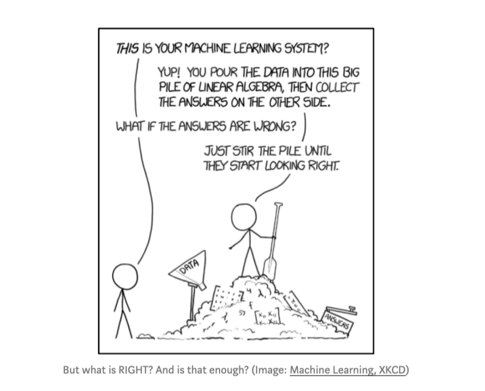

# [2024/12/14 - 2024/12/24]

Before starting this challenge, I already had [**intermediate proficiency**](https://github.com/paudelsamir/python-mastery) in **Python** and had worked on several basic to advanced [**EDA projects**](https://github.com/paudelsamir/EDA-Projects). I’m also familiar with **Statistics** and **Mathematics**, so now my goal is to revisit these topics with a **practical, data-driven focus**.

# Day 01 

 
### **1. Scalars, Vectors, Matrices, and Tensors**
- **Use in ML**: Basic data structures; feature vectors as inputs, datasets as matrices, and images as 3D tensors.

### **2. Linear Combination and Span**
- **Use in ML**: Represents data points as weighted sums, used in models like **Linear Regression** and neural networks.

### **3. Determinant**
- **Use in ML**: Checks matrix invertibility, ensuring unique solutions in systems like **linear regression**.

### **4. Dot and Cross Product**
- **Use in ML**: **Dot product** measures similarity (e.g., in **SVMs**), while **cross product** is used for vector transformations (less common).  

# Day 02
<!-- ### **5. Cramer's Rule**
- **Use in ML**: Solves linear systems, but not commonly used for large datasets.

### **6. 3D Transformation**
- **Use in ML**: Applied in **computer vision** for 3D object recognition and augmented reality.

### **7. Identity and Inverse Matrices**
- **Use in ML**: Used for solving equations (e.g., **linear regression**) and optimization (e.g., in **gradient descent**).

### **8. Eigenvalues and Eigenvectors**
- **Use in ML**: Essential for **PCA**, **SVD**, and feature extraction; eigenvalues capture variance, eigenvectors define directions.

### **9. Singular Value Decomposition (SVD)**
- **Use in ML**: Used for **PCA**, image compression, and **collaborative filtering** (e.g., recommendation systems).

 -->
[Notes Here](./data/Linear%20Algebra%20for%20ML.pdf)